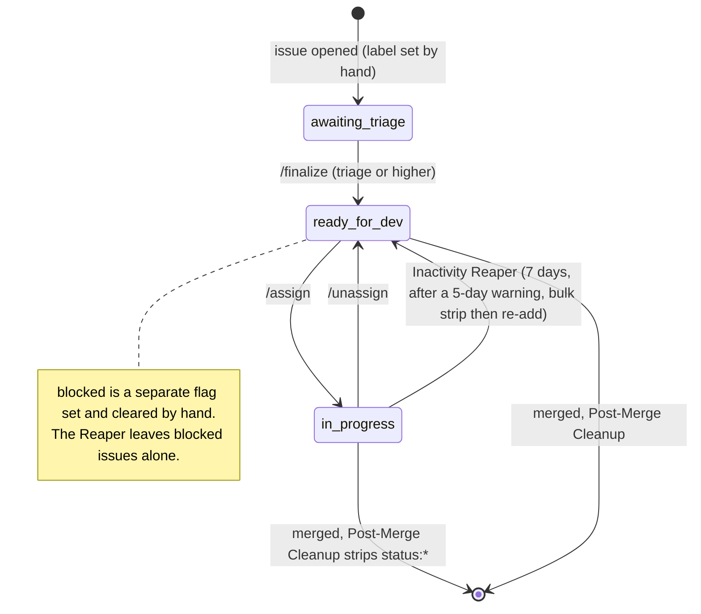
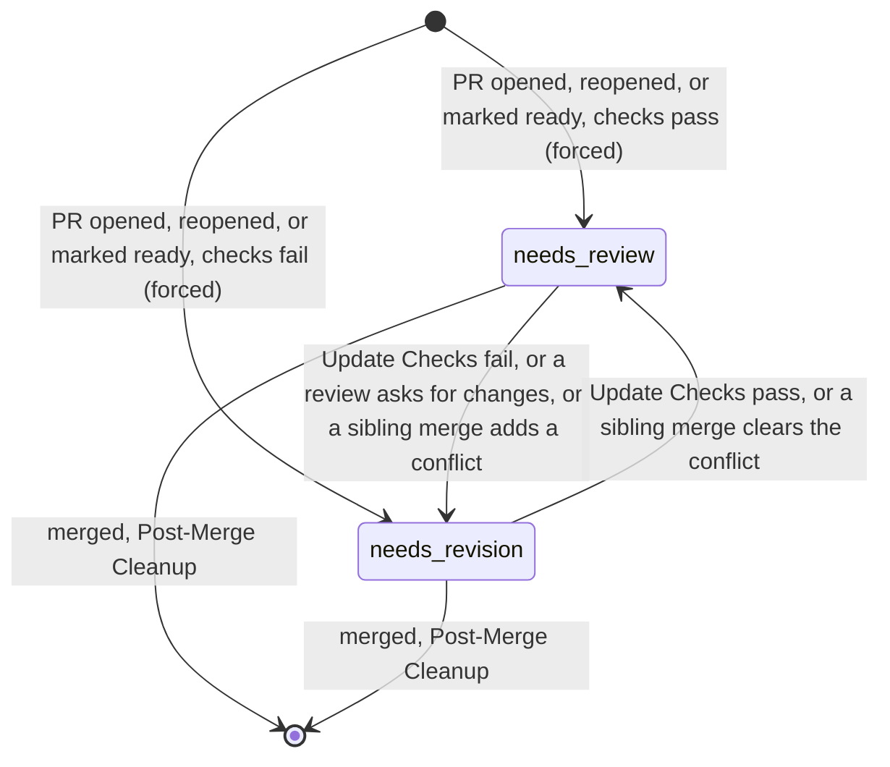

# Label Inventory: Hiero C++ SDK

> **What this covers:** every label that the maintainer automation under `.github/` of
> [`hiero-ledger/hiero-sdk-cpp`](https://github.com/hiero-ledger/hiero-sdk-cpp) reads or writes, and
> which service touches it.
> **Source state:** `main` at `a898153` (2026-05-14).
> **Phase:** 2 (Labels and flows). It builds on the Phase 1 service inventory in `audit/services-cpp.md`.
> **Left out on purpose:** the CI, build, lint, and test workflows (`zxc-*`, `flow-pull-request-checks`,
> `on-schedule-builds`). They were checked and they touch no labels at all (see Appendix C).

## How labels work in the C++ SDK

Here is the short version: every label string is written down in exactly one place,
`.github/hiero-automation.json`. The handlers never type a label out by hand. Instead they import it as
a frozen constant through `helpers/config-loader.js` and `helpers/constants.js`, so the code says
`LABELS.READY_FOR_DEV`, not the string `status: ready for dev`.

That single source of truth makes this audit easy: the 14 labels below are the whole automation surface,
with no variants and no spelling drift. The repository itself carries 33 labels in all, but the automation
only ever touches these 14. The full set, classified by who manages each, is in Appendix D.

The labels come in three families, all shaped `group: value` in lower case:

| Group | Labels |
|---|---|
| `status:` | `awaiting triage`, `ready for dev`, `in progress`, `blocked`, `needs review`, `needs revision` |
| `skill:` | `good first issue`, `beginner`, `intermediate`, `advanced` |
| `priority:` | `critical`, `high`, `medium`, `low` |

## Which service touches which label

How to read the columns: **Read** means the service checks the label as a condition. **Added** and
**Removed** mean it writes the label. "Bulk `status:*` strip" means the code removes every label whose
name starts with `status:` in one sweep (a prefix match), not a single named label.

### `status:` labels

| Label | Config key | Read by | Added by | Removed by |
|---|---|---|---|---|
| `status: awaiting triage` | `labels.status.awaitingTriage` | `/finalize` (must be present) | none (a person sets it before triage) | `/finalize` |
| `status: ready for dev` | `labels.status.readyForDev` | `/assign` (gate), Post-Merge Recommendation (used to find candidate issues) | `/finalize`, `/unassign`, Inactivity Reaper (when it resets an issue) | `/assign`, Post-Merge Cleanup (bulk strip), Inactivity Reaper (bulk strip before it re-adds) |
| `status: in progress` | `labels.status.inProgress` | Inactivity Reaper (issues without it are skipped) | `/assign` | `/unassign`, Inactivity Reaper (bulk strip), Post-Merge Cleanup (bulk strip) |
| `status: blocked` | `labels.status.blocked` | Inactivity Reaper (sends the item down the 30-day check-in path and exempts it from auto-close), `/assign` (blocked issues are not counted against the open-assignment limit) | none (a person sets it) | nothing targets it on its own, but the Post-Merge Cleanup and Reaper bulk `status:*` strips will remove it if it happens to be present at merge or reset |
| `status: needs review` | `labels.status.needsReview` | PR Open and Update Checks (to swap with the opposite label), Inactivity Reaper (PRs with it are skipped, the clock is paused), `/assign` (the needs-review-PR bypass for the assignment cap) | PR Open Checks (forced), PR Update Checks (conditional), Sibling Conflict Re-check | PR Review Applicator, PR Open and Update Checks, Sibling Conflict Re-check, Post-Merge Cleanup (bulk strip) |
| `status: needs revision` | `labels.status.needsRevision` | PR Open and Update Checks (to swap with the opposite label), Inactivity Reaper (the clock starts from when this label was applied) | PR Review Applicator (forced, on `changes_requested`), PR Open Checks (forced), PR Update Checks (conditional), Sibling Conflict Re-check | PR Open and Update Checks, Sibling Conflict Re-check, Post-Merge Cleanup (bulk strip) |

> **One `/finalize` dependency that is not a label.** Besides `awaiting triage`, `/finalize` reads the
> issue's native GitHub issue type (`issue.type.name`, one of `Bug`, `Feature`, `Task`) at
> `commands/finalize.js:99-102,133,167`. It is a validation gate only: the type is set by the issue
> template frontmatter (`type:` in `bug.yml`, `feature.yml`, `task.yml`), not by a label, and it is not in
> `hiero-automation.json`. The title and body rewrite is driven by skill level (`reconstructBody`,
> `buildNewTitle`), not by type. So `/finalize` depends on a native field as well as on labels.

### `skill:` labels

All four are read-only to the automation: people and issue templates apply them, no bot adds or removes
them. But read-only is not low-impact. The skill label is one of the most load-bearing inputs in the C++
automation, and recommendation (what its name suggests) is the smallest of its uses. By weight:

1. **The `/assign` prerequisite ladder.** `checkPrerequisites()` walks `skillPrerequisites` and
   `skillHierarchy` from the config. A `skill: beginner` issue needs 2 closed `skill: good first issue`
   issues; `skill: intermediate` needs 3 closed beginner; `skill: advanced` needs 3 closed intermediate.
   `skill: good first issue` has no prerequisite (`requiredCount: 0`).
2. **The good-first-issue completion cap.** `/assign` blocks anyone who has already closed
   `maxGfiCompletions` (5) good first issues, pushing them up the ladder.
3. **The `/finalize` title prefix.** Skill selects the `[Good First Issue]`, `[Beginner]`,
   `[Intermediate]`, or `[Advanced]` prefix (`SKILL_TITLE_PREFIXES`).
4. **The `/finalize` body boilerplate.** `reconstructBody` builds the rewritten body from the skill level.
5. **The `/finalize` exactly-one-skill check.** `/finalize` fails an issue without exactly one `skill:`
   label.
6. **Post-merge recommendation and level-up.** The smallest use, despite the name.

So skill gates who may take an issue, caps how much starter work one person can take, and rewrites the
issue's title and body. In this system it is an assignment and triage input, not just a recommendation
hint.

| Label | Config key | Read by |
|---|---|---|
| `skill: good first issue` | `labels.skill.goodFirstIssue` | `/assign` (the GFI completion cap and the prerequisite floor), `/finalize` (checks that exactly one `skill:` label is present), Post-Merge Recommendation (eligibility and grouping) |
| `skill: beginner` | `labels.skill.beginner` | `/assign` (prerequisite walk), `/finalize`, Post-Merge Recommendation |
| `skill: intermediate` | `labels.skill.intermediate` | same as beginner |
| `skill: advanced` | `labels.skill.advanced` | same as beginner |

### `priority:` labels

All four are read-only to the automation.

| Label | Config key | Read by |
|---|---|---|
| `priority: critical` | `labels.priority.critical` | Post-Merge Recommendation (sort order, via `priorityHierarchy`), `/finalize` (checks that exactly one `priority:` label is present) |
| `priority: high` | `labels.priority.high` | same |
| `priority: medium` | `labels.priority.medium` | same |
| `priority: low` | `labels.priority.low` | same |

## How labels move: the status state machine

Only `status:` labels actually move around. `skill:` and `priority:` are fixed inputs. There are two
separate flows, one for issues and one for PRs. They join at merge time, when the Post-Merge Cleanup
strips every `status:*` label from the merged PR and from the issues it closes.

### Issue status flow



Every edge, and the service that owns the write:

| From | To | Service | What triggers it |
|---|---|---|---|
| (none) | `awaiting triage` | set by hand | issue opened |
| `awaiting triage` | `ready for dev` | `/finalize` | a comment from someone with triage or higher, once the label checks pass |
| `ready for dev` | `in progress` | `/assign` | a comment, if the issue is unassigned, has a skill label, the user is under their limits, and prerequisites are met |
| `in progress` | `ready for dev` | `/unassign` | a comment from the current assignee |
| `in progress` | `ready for dev` | Inactivity Reaper | the daily cron, after 7 days of inactivity (a warning goes out at 5 days first) |
| any `status:*` | (removed) | Post-Merge Cleanup | an issue that a merged PR closes |

### PR status flow



| From | To | Service | What triggers it |
|---|---|---|---|
| (any) | `needs review` | PR Open Checks | PR opened, reopened, or marked ready, and all four checks pass (forced) |
| (any) | `needs revision` | PR Open Checks | PR opened, reopened, or marked ready, and any check fails (forced) |
| `needs revision` | `needs review` | PR Update Checks | a push or a body edit, checks pass, and the opposite label is already there |
| `needs review` | `needs revision` | PR Update Checks | a push or a body edit, checks fail, and the opposite label is already there |
| `needs review` | `needs revision` | PR Review Applicator | a review submitted as `changes_requested` (forced) |
| `needs revision` | `needs review` | Sibling Conflict Re-check | another PR merges and this PR's conflict clears |
| `needs review` | `needs revision` | Sibling Conflict Re-check | another PR merges and introduces a conflict here |
| any `status:*` | (removed) | Post-Merge Cleanup | the merged PR itself |

**What `force` does.** The forced writers (PR Open Checks, PR Review Applicator) force only the *add*:
they apply the target label even when the opposite is absent. PR Update Checks and Sibling Conflict
Re-check are not forced, so they act only when the opposite label is already present, leaving a PR with no
status label untouched. Removal is always conditional on the label being present (a `hasLabel` check);
`force` never makes a removal unconditional. So PR Review Applicator always adds `needs revision` but
removes `needs review` only when it is there.

## Prefix scans (operations on a whole label family)

| Prefix | Where | What it does |
|---|---|---|
| `status:` | Inactivity Reaper, `resetItem()` in `bot-inactivity.js` | removes every `status:*` label, then optionally re-adds `ready for dev` |
| `status:` | Post-Merge Cleanup, `removeStatusLabels()` in `bot-on-pr-close.js` | removes every `status:*` label from the merged PR and the issues it closes |
| `skill:` | `/finalize` in `commands/finalize.js` | reads all `skill:` labels to check there is exactly one, and to build the title prefix |
| `priority:` | `/finalize` | reads all `priority:` labels to check there is exactly one |

Why this matters: the two bulk strips are not limited to the six known `status:` strings; any label
starting with `status:` is removed too. So the strip is a namespace operation, not a six-string one, which
is a property of the current design worth recording (Appendix D has the concrete risk).

## Labels created at runtime

There are none. There is no `createLabel`, `ensureLabel`, `labels.create`, or `gh label create` anywhere
in `.github/scripts/`. All 14 labels have to already exist in the repository. (Python is different here:
it auto-creates its queue labels. See `audit/labels-python.md`.)

## Differences from Phase 1 and from the source

The live source at `a898153` uses exactly these 14 labels. Every label from the Phase 1 Appendix B is in
`hiero-automation.json` and used by at least one code path. No alias drift, no hard-coded label string, no
label created at runtime.

## Appendix A: config key to label string

```
labels.status.awaitingTriage  -> status: awaiting triage
labels.status.readyForDev     -> status: ready for dev
labels.status.inProgress      -> status: in progress
labels.status.blocked         -> status: blocked
labels.status.needsReview     -> status: needs review
labels.status.needsRevision   -> status: needs revision
labels.skill.goodFirstIssue   -> skill: good first issue
labels.skill.beginner         -> skill: beginner
labels.skill.intermediate     -> skill: intermediate
labels.skill.advanced         -> skill: advanced
labels.priority.critical      -> priority: critical
labels.priority.high          -> priority: high
labels.priority.medium        -> priority: medium
labels.priority.low           -> priority: low
```

## Appendix B: who can change what

| Service | Adds | Removes |
|---|---|---|
| `/finalize` | `ready for dev` | `awaiting triage` |
| `/assign` | `in progress` | `ready for dev` |
| `/unassign` | `ready for dev` | `in progress` |
| PR Open Checks | `needs review` or `needs revision` (forced) | the opposite one |
| PR Update Checks | `needs review` or `needs revision` (conditional) | the opposite one |
| PR Review Applicator | `needs revision` (forced) | `needs review` |
| Sibling Conflict Re-check | `needs review` or `needs revision` | the opposite one |
| Post-Merge Cleanup | none | all `status:*` (bulk) |
| Inactivity Reaper | `ready for dev` (issues only) | all `status:*` (bulk) |

`skill:` and `priority:` show up under no writer at all, which confirms they are read-only inputs to the
C++ automation.

## Appendix C: out-of-scope workflows (no label contact)

The CI, build, lint, and test workflows (`zxc-build-library.yaml`, `zxc-lint-workflows.yaml`,
`zxc-test-bot-scripts.yaml`, `flow-pull-request-checks.yaml`, `on-schedule-builds.yaml`) were searched for
`label`, `status:`, `skill:`, and `priority:` and match none. They are a project non-goal
(`planning/goals.md`, Non-goals) and are left out of the flow analysis.

## Appendix D: the whole repository label set (not just the automated 14)

The body of this document covers the 14 labels the automation reads or writes. The repository itself has
33 labels (from `gh label list --repo hiero-ledger/hiero-sdk-cpp`). The other 19 are managed by people,
by issue templates, by Dependabot, or by campaigns, and the automation never references them. This
appendix lists all 33 so the gap between "the automation surface" and "the repository surface" is on the
record, because that gap is where the one real risk below lives.

### Automation-managed (14): defined in `hiero-automation.json`, read or written by the bots

| Label | How the automation uses it | How it gets applied |
|---|---|---|
| `status: awaiting triage` | read and removed by `/finalize` | auto-applied by the issue templates on open |
| `status: ready for dev` | read and written across `/finalize`, `/assign`, `/unassign`, Reaper, Recommendation | by the automation |
| `status: in progress` | read and written by `/assign`, `/unassign`, Reaper, Post-Merge Cleanup | by the automation |
| `status: blocked` | read by `/assign` and the Reaper | set and cleared by hand |
| `status: needs review` | read and written across the PR services | by the automation |
| `status: needs revision` | read and written across the PR services | by the automation |
| `skill: good first issue` | read by `/assign`, `/finalize`, Recommendation | applied by hand or by template |
| `skill: beginner` | read by `/assign`, `/finalize`, Recommendation | applied by hand or by template |
| `skill: intermediate` | read by `/assign`, `/finalize`, Recommendation | applied by hand or by template |
| `skill: advanced` | read by `/assign`, `/finalize`, Recommendation | applied by hand or by template |
| `priority: critical` | read by `/finalize` and Recommendation | applied by hand |
| `priority: high` | read by `/finalize` and Recommendation | applied by hand |
| `priority: medium` | read by `/finalize` and Recommendation | applied by hand |
| `priority: low` | read by `/finalize` and Recommendation | applied by hand |

### Unmanaged `status:` labels (2): manual, and the automation does not know they exist

| Label | Managed by | Note |
|---|---|---|
| `status: needs info` | a maintainer, by hand | not in the config |
| `status: awaiting merge` | a maintainer, by hand | not in the config |

**The one real risk in this appendix.** The two bulk `status:*` strips (Post-Merge Cleanup and the
Inactivity Reaper, see "Prefix scans" above) remove every label starting with `status:`, not just the six
in the config. So `status: needs info` and `status: awaiting merge` are stripped on merge or on a reaper
reset even though no config entry mentions them: a maintainer who sets `status: awaiting merge` on a PR
will see it vanish when the PR merges. This is the key coupling and fragility finding in the current C++
design: a prefix strip acts on the whole namespace, so the `status:` set is implicitly coupled and labels
the config does not know about are still affected.

### `scope:` family (11): all manual, automation ignores all of them

`scope: api`, `scope: build`, `scope: ci`, `scope: core`, `scope: crypto`, `scope: dependencies`,
`scope: docs`, `scope: examples`, `scope: network`, `scope: security`, `scope: tests`. These are applied
by people to classify the area of a change. The automation references none of them. (`scope: ci` is the
label behind the maintainer's earlier "scope/CI" question: it is a manual classification label, not a CI
trigger.)

### Dependabot-created (3): applied automatically by Dependabot, not by the automation

`dependencies`, `github_actions`, `vcpkg_package_manager`. These come from `dependabot.yml` (the vcpkg
package-manager config creates `vcpkg_package_manager`). Note that the bare `dependencies` label here is a
different label from `scope: dependencies` above.

### Campaign (2) and migration (1)

| Label | Kind |
|---|---|
| `hacktoberfest` | Hacktoberfest campaign |
| `hacktoberfest-accepted` | Hacktoberfest campaign |
| `Hiero Transfer` | one-off migration label from the move to Hiero |

That is 14 + 2 + 11 + 3 + 2 + 1 = 33, matching the live repository.
