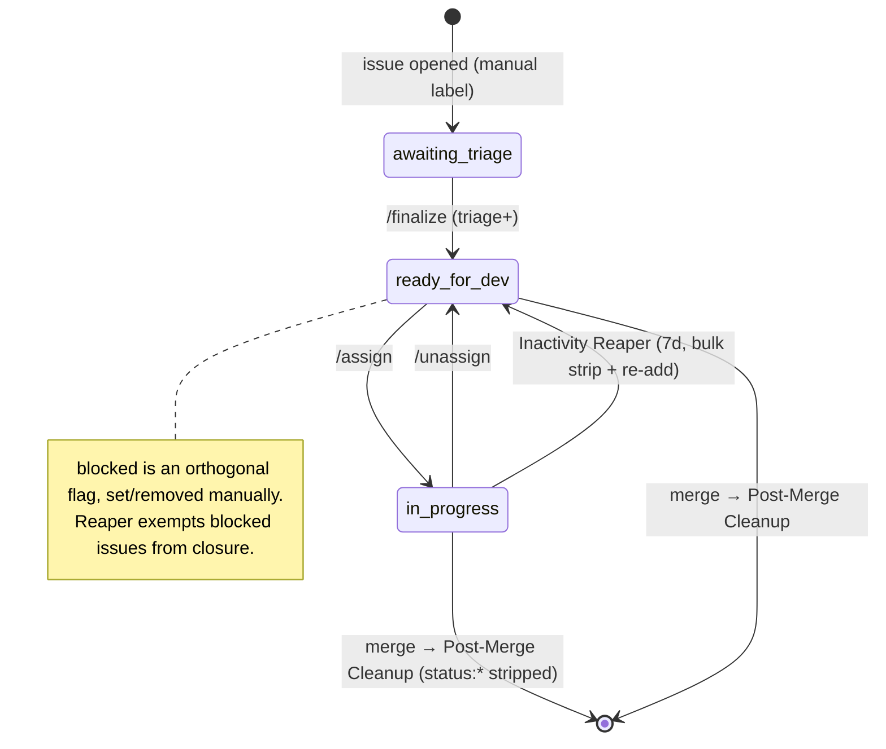
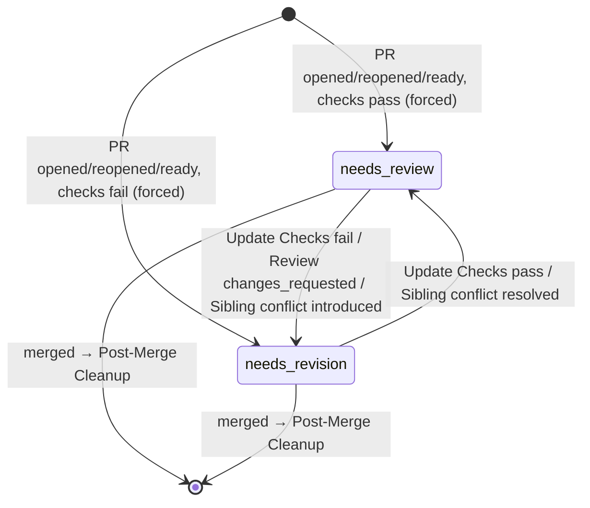

# Label Inventory — Hiero C++ SDK

> **Audit scope:** every label the maintainer-automation under `.github/` of
> [`hiero-ledger/hiero-sdk-cpp`](https://github.com/hiero-ledger/hiero-sdk-cpp) reads or writes,
> mapped to the services that touch it.
> **Source state:** `main` @ `a898153` (2026-05-14).
> **Phase:** 2 (Labels & flows). Builds on the Phase 1 service inventory (`audit/services-cpp.md`).
> **Out of scope:** CI/build/lint/test workflows (`zxc-*`, `flow-pull-request-checks`,
> `on-schedule-builds`) — confirmed to read or write **no labels** (see Appendix C).

## How labels work in the C++ SDK

Every label string is defined **once**, in `.github/hiero-automation.json`, and surfaced to the
handlers as frozen constants through `helpers/config-loader.js` → `helpers/constants.js`. No handler
contains a hard-coded label literal — code references config keys (`LABELS.READY_FOR_DEV`), never the
string `status: ready for dev`. This is the single-source-of-truth property the wider decoupling effort
wants to preserve, and it makes the label taxonomy trivially auditable: the 14 labels below are the
**entire** label surface, with **zero alias drift**.

Three label families, all `<group>: <value>` lower-case:

| Group | Labels |
|---|---|
| `status:` | `awaiting triage`, `ready for dev`, `in progress`, `blocked`, `needs review`, `needs revision` |
| `skill:` | `good first issue`, `beginner`, `intermediate`, `advanced` |
| `priority:` | `critical`, `high`, `medium`, `low` |

## Label → service map

Legend: **R** = read as a gate/condition · **A** = added · **D** = removed. "Bulk `status:*` strip" =
removal via a prefix scan (`startsWith("status:")`), not an exact-string removal.

### `status:` labels

| Label | Config key | Read by | Added by | Removed by |
|---|---|---|---|---|
| `status: awaiting triage` | `labels.status.awaitingTriage` | `/finalize` (R: must be present) | — (set manually pre-triage) | `/finalize` (D) |
| `status: ready for dev` | `labels.status.readyForDev` | `/assign` (R: gate), Post-Merge Recommendation (R: candidate search) | `/finalize` (A), `/unassign` (A), Inactivity Reaper (A: issue reset) | `/assign` (D), Post-Merge Cleanup (D: bulk strip), Inactivity Reaper (D: bulk strip pre-reset) |
| `status: in progress` | `labels.status.inProgress` | Inactivity Reaper (R: issues without it are skipped) | `/assign` (A) | `/unassign` (D), Inactivity Reaper (D: bulk strip), Post-Merge Cleanup (D: bulk strip) |
| `status: blocked` | `labels.status.blocked` | Inactivity Reaper (R: routes to 30-day check-in path, exempt from closure), `/assign` (R: excluded from open-assignment count) | — (set manually) | no service *targets* it, **but** Post-Merge Cleanup / Reaper bulk `status:*` strips remove it if present at merge/reset |
| `status: needs review` | `labels.status.needsReview` | PR Open/Update Checks (R: opposite-label swap), Inactivity Reaper (R: PRs with it are skipped — clock suspended), `/assign` (R: needs-review-PR bypass for the assignment cap) | PR Open Checks (A: forced), PR Update Checks (A: conditional), Sibling Conflict Re-check (A) | PR Review Applicator (D), PR Open/Update Checks (D), Sibling Conflict Re-check (D), Post-Merge Cleanup (D: bulk strip) |
| `status: needs revision` | `labels.status.needsRevision` | PR Open/Update Checks (R: opposite-label swap), Inactivity Reaper (R: clock starts at label-applied time) | PR Review Applicator (A: forced on `changes_requested`), PR Open Checks (A: forced), PR Update Checks (A: conditional), Sibling Conflict Re-check (A) | PR Open/Update Checks (D), Sibling Conflict Re-check (D), Post-Merge Cleanup (D: bulk strip) |

### `skill:` labels

All four are **read-only** to the automation — applied by humans/templates, never added or removed by a
bot. They gate assignment and drive recommendations.

| Label | Config key | Read by |
|---|---|---|
| `skill: good first issue` | `labels.skill.goodFirstIssue` | `/assign` (GFI completion cap, prerequisite floor), `/finalize` (R: exactly one `skill:` required), Post-Merge Recommendation (eligibility + grouping) |
| `skill: beginner` | `labels.skill.beginner` | `/assign` (prerequisite walk), `/finalize`, Post-Merge Recommendation |
| `skill: intermediate` | `labels.skill.intermediate` | same as beginner |
| `skill: advanced` | `labels.skill.advanced` | same as beginner |

### `priority:` labels

All four are **read-only** to the automation.

| Label | Config key | Read by |
|---|---|---|
| `priority: critical` | `labels.priority.critical` | Post-Merge Recommendation (sort via `priorityHierarchy`), `/finalize` (R: exactly one `priority:` required) |
| `priority: high` | `labels.priority.high` | same |
| `priority: medium` | `labels.priority.medium` | same |
| `priority: low` | `labels.priority.low` | same |

## Label flow — the status state machine

Only `status:` labels move; `skill:`/`priority:` are static inputs. There are two distinct
sub-machines — one for **issues**, one for **PRs** — joined at merge by the Post-Merge Cleanup, which
strips all `status:*` from the merged PR and its linked issues.

### Issue status flow



Every edge, with the service that owns the write:

| From | To | Service | Trigger |
|---|---|---|---|
| _(none)_ | `awaiting triage` | _manual_ | issue opened |
| `awaiting triage` | `ready for dev` | `/finalize` | comment, triage+ permission, label validation passes |
| `ready for dev` | `in progress` | `/assign` | comment; gates: unassigned, skill present, under limits, prereqs met |
| `in progress` | `ready for dev` | `/unassign` | comment by current assignee |
| `in progress` | `ready for dev` | Inactivity Reaper | daily cron, 7 days inactive (5-day warning first) |
| any `status:*` | _(removed)_ | Post-Merge Cleanup | linked issue of a merged PR |

### PR status flow



| From | To | Service | Trigger |
|---|---|---|---|
| _(any)_ | `needs review` | PR Open Checks | PR opened/reopened/ready, all 4 checks pass (force-applied) |
| _(any)_ | `needs revision` | PR Open Checks | PR opened/reopened/ready, any check fails (force-applied) |
| `needs revision` | `needs review` | PR Update Checks | synchronize/body-edit, checks pass, opposite label present |
| `needs review` | `needs revision` | PR Update Checks | synchronize/body-edit, checks fail, opposite label present |
| `needs review` | `needs revision` | PR Review Applicator | review submitted `changes_requested` (force-applied) |
| `needs revision` | `needs review` | Sibling Conflict Re-check | sibling PR merges, this PR's conflict clears |
| `needs review` | `needs revision` | Sibling Conflict Re-check | sibling PR merges, introduces a conflict here |
| any `status:*` | _(removed)_ | Post-Merge Cleanup | the merged PR itself |

**`force` semantics:** `force=true` (PR Open Checks, PR Review Applicator) governs only the **add** side —
the target label is applied even when the opposite label is absent. PR Update Checks and Sibling Conflict
Re-check are non-forced — they add **only if** the opposite label is already present, so a PR with no
status label is left untouched. In **all** cases the **removal** of the opposite label is conditional on
it actually being present (`hasLabel`); `force` never makes a removal unconditional. So e.g. PR Review
Applicator always adds `needs revision` but only removes `needs review` when it is there.

## Prefix scans (family-level operations)

| Prefix | Where | Effect |
|---|---|---|
| `status:` | Inactivity Reaper `resetItem()` (`bot-inactivity.js`) | strips **all** `status:*` before optionally re-adding `ready for dev` |
| `status:` | Post-Merge Cleanup `removeStatusLabels()` (`bot-on-pr-close.js`) | strips **all** `status:*` from merged PR + linked issues |
| `skill:` | `/finalize` (`commands/finalize.js`) | reads all `skill:` for "exactly one" validation + title prefix |
| `priority:` | `/finalize` | reads all `priority:` for "exactly one" validation |

**Consequence:** the two bulk strips are not limited to the six known `status:` strings — any future
`status:`-prefixed label would also be removed. Relevant when generalizing: the strip is a family
operation, so the shared schema must treat `status:` as a managed namespace, not a fixed enum.

## Runtime-created labels

**None.** No `createLabel` / `ensureLabel` / `labels.create` / `gh label create` anywhere in
`.github/scripts/`. All 14 labels must pre-exist in the repository. (Contrast: Python auto-creates its
queue labels — see `audit/labels-python.md`.)

## Delta vs Phase 1 / vs source

The live source at `a898153` references exactly the 14 labels above — no more, no fewer. Every label in
the Phase 1 Appendix B is confirmed in `hiero-automation.json` and exercised by at least one code path.
**Zero alias drift, zero hard-coded literals, zero runtime label creation.**

## Appendix A — config-key ↔ label-string map

```
labels.status.awaitingTriage  → status: awaiting triage
labels.status.readyForDev     → status: ready for dev
labels.status.inProgress      → status: in progress
labels.status.blocked         → status: blocked
labels.status.needsReview     → status: needs review
labels.status.needsRevision   → status: needs revision
labels.skill.goodFirstIssue   → skill: good first issue
labels.skill.beginner         → skill: beginner
labels.skill.intermediate     → skill: intermediate
labels.skill.advanced         → skill: advanced
labels.priority.critical      → priority: critical
labels.priority.high          → priority: high
labels.priority.medium        → priority: medium
labels.priority.low           → priority: low
```

## Appendix B — labels by writer (who can mutate what)

| Service | Adds | Removes |
|---|---|---|
| `/finalize` | `ready for dev` | `awaiting triage` |
| `/assign` | `in progress` | `ready for dev` |
| `/unassign` | `ready for dev` | `in progress` |
| PR Open Checks | `needs review` / `needs revision` (forced) | the opposite |
| PR Update Checks | `needs review` / `needs revision` (conditional) | the opposite |
| PR Review Applicator | `needs revision` (forced) | `needs review` |
| Sibling Conflict Re-check | `needs review` / `needs revision` | the opposite |
| Post-Merge Cleanup | — | all `status:*` (bulk) |
| Inactivity Reaper | `ready for dev` (issues only) | all `status:*` (bulk) |

`skill:` and `priority:` appear under no writer — confirming they are read-only inputs to the C++ automation.

## Appendix C — out-of-scope workflows (no label contact)

`zxc-build-library.yaml`, `zxc-lint-workflows.yaml`, `zxc-test-bot-scripts.yaml`,
`flow-pull-request-checks.yaml`, `on-schedule-builds.yaml` — grepped for `label` / `status:` / `skill:`
/ `priority:`: **no matches**. These are CI/build/lint/test and are a project non-goal
(`planning/goals.md` §Non-goals); listed here only to close the audit, excluded from all flow analysis.
