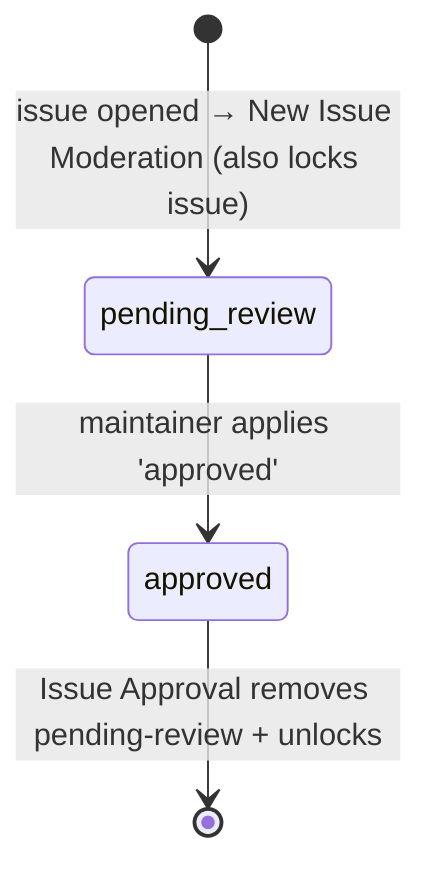
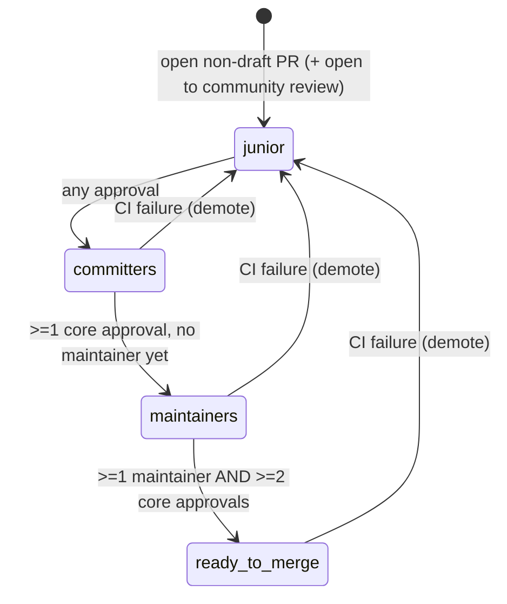

# Label Inventory — Hiero Python SDK

> **Audit scope:** every label the maintainer-automation under `.github/` of
> [`hiero-ledger/hiero-sdk-python`](https://github.com/hiero-ledger/hiero-sdk-python) reads or writes,
> mapped to the services that touch it, **plus the alias-drift catalog**.
> **Source state:** `main` @ `cbb41d9` (moved from Phase 1's `5df93b7`; deltas noted inline).
> **Phase:** 2 (Labels & flows). Builds on `audit/services-python.md`.
> **Out of scope:** CI/build/security/release workflows (`pr-check-*`, `pre-commit`, `publish`,
> `release-pr-coderabbit-gate`, `clusterfuzzlite`, `test-*`) — confirmed to read or write **no labels**;
> `pr-check-feedback-all.yml` reads PR data only. Excluded from flow analysis (Appendix D).

## How labels work in the Python SDK

The opposite of C++. There is **no single policy file**. Label strings come from three places:

1. `scripts/shared/labels.js` — the skill/difficulty constants (`GOOD_FIRST_ISSUE_LABEL`, …).
2. `scripts/labels.js` and `scripts/review-sync/helpers/constants.js` — `notes:` and `queue:` constants.
3. **Inlined literals** in individual workflow `if:` conditions and shell/JS scripts — `pending-review`,
   `approved`, `discussion`, `notes: spam`, `notes: mentor-duty`, `priority: critical`, bare `beginner`.

Because the same concept is expressed in several files, the Python surface carries **real alias drift**
(§Alias-drift catalog) — the single most important input for the normalized taxonomy the shared app needs.

## Label → service map

Legend: **R** read/gate · **A** added · **D** removed.

### Skill / difficulty

| Label | Read by | Added by | Removed by | Defined in |
|---|---|---|---|---|
| `Good First Issue` | GFI Assign, Beginner Assign (GFI guard), Assignment Limit Enforcer, Mentor Assignment (chained), Spam List Maintenance, Next Issue Recommendation | issue template | — | `scripts/shared/labels.js` (`GOOD_FIRST_ISSUE_LABEL`) — but re-hardcoded inline in `bot-beginner-assign-on-comment.js` (drift D) |
| `Good First Issue Candidate` | GFI Candidate Notification | issue template | — | `scripts/shared/labels.js` (`GOOD_FIRST_ISSUE_CANDIDATE_LABEL`); workflow gate uses lowercase variant (drift A) |
| `skill: beginner` | Beginner Assign, Intermediate Guard (prereq), Triage Review Request, CodeRabbit Plan Trigger, Next Issue Recommendation | issue template | — | `scripts/shared/labels.js` (`BEGINNER_LABEL`); bare `beginner` also checked (drift C) |
| `skill: intermediate` | Intermediate Guard, Advanced Check (prereq), CodeRabbit Plan Trigger, Next Issue Recommendation | issue template | — | `scripts/shared/labels.js` (`INTERMEDIATE_LABEL`) |
| `skill: advanced` | Advanced Check, CodeRabbit Plan Trigger, Next Issue Recommendation | issue template | — | `scripts/shared/labels.js` (`ADVANCED_LABEL`) |

> Like C++, skill labels are **read-only** to the bots (templates apply them). They gate the assignment
> ladder; none is added or removed programmatically.

### Review queue (the PR review state machine)

All five are **owned and auto-created** by Review Queue Label Sync (`review-sync.yml`); it is the only
writer.

| Label | Read by | Added by | Removed by | Defined in |
|---|---|---|---|---|
| `queue:junior-committer` | Review Queue Sync | Review Queue Sync | Review Queue Sync (stale cleanup) | `review-sync/helpers/constants.js` |
| `queue:committers` | Review Queue Sync | Review Queue Sync | Review Queue Sync | same |
| `queue:maintainers` | Review Queue Sync | Review Queue Sync | Review Queue Sync | same |
| `status: ready-to-merge` | Review Queue Sync | Review Queue Sync | Review Queue Sync | same |
| `open to community review` | Review Queue Sync | Review Queue Sync (every open non-draft PR) | — (never removed) | same |

> **Cross-SDK collision to note:** `status: ready-to-merge` lives in the **`status:`** namespace but is
> owned by Python's queue machine, while C++'s `status:` namespace is its issue/PR review machine. The
> normalized taxonomy must reconcile these (see `docs/services.md`).

### Lifecycle / moderation

| Label | Read by | Added by | Removed by | Defined in |
|---|---|---|---|---|
| `pending-review` | (implied by approval flow) | New Issue Moderation | Issue Approval | inlined in workflows |
| `approved` | Issue Approval (trigger `event.label.name == 'approved'`) | manual maintainer | — | inlined |
| `discussion` | Inactivity Unassign (skip guard, `grep -qi` → case-insensitive) | manual | — | inlined in `bot-inactivity-unassign.sh` |

### Notes / admin

| Label | Read by | Added by | Removed by | Defined in |
|---|---|---|---|---|
| `notes: broken markdown links` | Cron Broken Links (find existing issue) | Cron Broken Links (tracking issue) | — | `scripts/labels.js` |
| `notes: automated` | Cron Broken Links, Spam List Maintenance | Cron Broken Links, Spam List Maintenance | — | `scripts/labels.js` |
| `notes: spam` | Spam List Maintenance (query closed unmerged PRs) | manual maintainer | — | inlined (`cron-admin-update-spam-list.js`) |
| `notes: spam-list-update` | Spam List Maintenance (dedup) | Spam List Maintenance (tracking issue) | — | inlined |
| `notes: mentor-duty` | Assignment Limit Enforcer (excluded from triage-user count) | manual | — | inlined (`bot-assignment-check`) |

### Priority

| Label | Read by | Added by | Removed by | Defined in |
|---|---|---|---|---|
| `priority: critical` | P0 Issue Team Alert | manual | — | inlined (`bot-p0-issues-notify-team.js`) |
| `Priority: Critical` | P0 Issue Team Alert (second `||` branch) | manual | — | inlined (workflow only) — drift B |

### Passthrough (no fixed string)

| "Label" | Behaviour |
|---|---|
| _any label on a linked issue_ | **Linked Issue Label Sync** (compute + apply) copies **all** labels from a PR's linked issue onto the PR, with no allowlist. So `notes:`, `skill:`, lifecycle labels, etc. can propagate issue→PR. A generalization risk: no namespace gating. |

## Alias-drift catalog (the headline finding)

Four drift sets. **Important correction:** GitHub Actions `contains()` is **case-insensitive** (per
GitHub expression docs), so casing differences in workflow `if:` guards still *match* at runtime — none
of these is a dead workflow. The risk is **fragility and ambiguity**, not breakage: the same concept has
multiple canonical spellings, scattered definitions, and inconsistent normalization, which is exactly
what a shared taxonomy must collapse.

### Drift A — GFI Candidate casing
| Variant | Where | Match method |
|---|---|---|
| `Good First Issue Candidate` | `shared/labels.js` constant; issue template `labels:`; `bot-gfi-candidate-notification.js` (`.toLowerCase()` compare) | canonical |
| `good first issue candidate` | `bot-gfi-candidate-notification.yaml` `if:` guard | `contains()` — case-insensitive, **so it matches** |

**Severity: low-functional / high-hygiene.** Works today (contains is case-insensitive), but the gate
string and the canonical constant disagree. A future move to a case-sensitive matcher, or a label
rename, silently breaks it.

### Drift B — Priority Critical casing
| Variant | Where |
|---|---|
| `priority: critical` | `bot-p0-issues-notify-team.js` constant + workflow first branch |
| `Priority: Critical` | workflow `if:` second `||` branch |

**Severity: low/tolerated.** The workflow deliberately accepts both with `||`, and the JS normalizes via
`.toLowerCase()`. But two distinct label strings exist for one concept, with no canonical source — the
taxonomy must pick one.

### Drift C — beginner: namespaced vs bare
| Variant | Where |
|---|---|
| `skill: beginner` | `shared/labels.js`; beginner/intermediate/coderabbit/triage paths |
| `beginner` (bare) | `request-triage-review.yml` — a third `contains()` trigger branch |

**Severity: medium.** The bare `beginner` has no definition and likely targets cross-repo PRs or legacy
labels; it can over-trigger if a bare `beginner` is ever applied in this repo. Real namespace
inconsistency for the same skill tier.

### Drift D — `Good First Issue` defined twice
| Source | Form |
|---|---|
| `shared/labels.js` `GOOD_FIRST_ISSUE_LABEL` | imported by most scripts |
| `bot-beginner-assign-on-comment.js` | re-declares `const GFI_LABEL = 'Good First Issue'` inline instead of importing |

**Severity: low-medium (structural).** Same value today, but a rename of the GFI label updates the shared
constant and **misses** this inlined copy — a latent single-rename-two-places hazard.

## Label flow — the state machines

Python has **no unified status machine**. Labels move in two independent sub-machines; the skill ladder
is a set of *read gates*, not transitions.

### Issue moderation flow



| From | To | Service | Trigger |
|---|---|---|---|
| _(none)_ | `pending-review` | New Issue Moderation | `issues: opened` (also locks the issue) |
| `pending-review` (+`approved`) | _(pending-review removed)_ | Issue Approval | `issues: labeled` = `approved` (also unlocks) |

### Review-queue flow (owned entirely by Review Queue Label Sync, `*/30` cron)



The sync is **add-then-remove** (target label added before stale labels removed) so a crash can never
leave a PR with zero queue labels. It aborts if the rate-limit budget is `< 200`.

> **Routing nuances** (the label is recomputed from scratch each cron cycle — it is a stateless
> classifier, not edge-triggered). `determineLabel()` branches, in priority order: CI failing →
> `junior-committer` (demote from any state); ≥1 maintainer **and** ≥2 core approvals → `ready to merge`;
> ≥1 maintainer but `<2` core → `committers` (a maintainer approving *first* routes the PR back to
> `committers` to attract committer review, **not** straight to `maintainers`); ≥1 core (no maintainer) →
> `maintainers`; any approval → `committers`; else → `junior-committer`. The diagram shows the common
> forward path; the early-maintainer case is the notable exception.

### Skill ladder — read gates (not label writes)

```
Good First Issue ──(≥1 closed GFI)──▶ skill: beginner ──(≥1 closed beginner)──▶ skill: intermediate ──(≥1 closed intermediate)──▶ skill: advanced
```

Each guard (`bot-beginner-assign-on-comment`, `bot-intermediate-assignment`, `bot-advanced-check`)
**reads** the labels and the contributor's closed-issue history to allow or block/unassign. It never
mutates the skill label. Core team (admin/maintain/write/triage, with per-guard variation) bypasses.

## Runtime-created labels

| Label(s) | Creator | Mechanism |
|---|---|---|
| `queue:junior-committer`, `queue:committers`, `queue:maintainers`, `status: ready-to-merge`, `open to community review` | Review Queue Label Sync | `issues.createLabel()` via `ensureLabel()` (idempotent, 422-safe, fixed colors) |
| `notes: broken markdown links`, `notes: automated` | Cron Broken Links | **not** created — passed to `issues.create({labels})`; must pre-exist or are dropped |
| `notes: spam-list-update`, `notes: automated` | Spam List Maintenance | same — passed to `issues.create`, not created |

**Contrast with C++:** Python *does* auto-create labels (queue family), but only there; the `notes:`
tracking labels are assumed to pre-exist. A generalized app needs one consistent ensure-label policy.

## Defined-but-undefined / referenced-but-undefined

Labels **used by active scripts but defined in no `labels.js`** (inlined literals — drift surface):
`pending-review`, `approved`, `discussion`, `notes: spam`, `notes: spam-list-update`,
`notes: mentor-duty`, `priority: critical`, `Priority: Critical`, bare `beginner`.

This is the structural root of the drift: ~9 labels live only as scattered string literals, so there is
no single place to rename or validate them.

## Archive note (feeds "retired" classification in `docs/services.md`)

The 10 archived workflows in `.github/workflows/archive/` reference **no archive-only labels** — the only
labels they touch (`Good First Issue`) are still active. `bot-mentor-assignment.yml` is archived because
its logic was **inlined** into `bot-gfi-assign-on-comment.js` (chained), not retired. So "retired
services" do not orphan any labels; they were folded or dropped without label residue.

## Delta vs Phase 1 (`5df93b7` → `cbb41d9`)

Re-read at the newer commit. The label set and service-label mapping match the Phase 1 Appendix B/C; no
labels were added or removed between the two commits that affect this inventory. (Any wording the
verifiers flag against `cbb41d9` is corrected before commit.)

## Appendix D — out-of-scope workflows (no label contact)

`pr-check-primary-codecov`, `pr-check-primary-codeql`, `pr-check-primary-broken-links`,
`pr-check-primary-test-files`, `clusterfuzzlite`,
`pr-check-secondary-{deps-test,examples,tck-test,unit-integration-test}`, `pre-commit`, `publish`,
`release-pr-coderabbit-gate`, `test-on-review`, `test-review-sync`, `pr-check-feedback-all` — read/write
no labels (the last reads PR data only). The two `pr-check-primary-{broken-links,test-files}` are
per-PR repo-hygiene checks (markdown links, test-file naming) — CI-adjacent, also no label contact.
Project non-goal (`planning/goals.md` §Non-goals); excluded from flow analysis.
