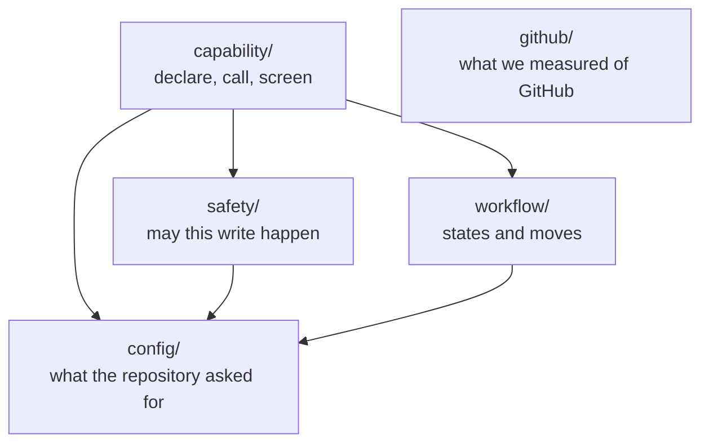

# automation-core (pure logic)

The parallel track from `design/build-plan.md` ("Parallel work the gates do
not block"): the work-item state machine, the safety engine, and the
configuration validator as typed code with invariant tests. No I/O, no
GitHub, no platform — `pnpm test` runs the whole thing in under a second.

| Directory | The question it answers | Files |
|---|---|---|
| `src/config/` | What did this repository ask for? | `schema.ts` (shape and enumerations), `validate.ts` (the six section validators), `parse.ts` (`parseConfig`) |
| `src/workflow/` | What states exist, and how do they move? | `meanings.ts` (vocabulary), `transitions.ts` (the diagrams as tables), `apply.ts` (the rules that walk them), `project.ts` (observed labels → position) |
| `src/capability/` | What may a capability declare and do? | `declaration.ts` (what it is), `catalogue.ts` (the closed vocabularies), `boundary.ts` (how the platform calls it), `intent.ts` (what it asks for, and the screens) |
| `src/safety/` | May this write happen? | `write.ts` (the general rules), `destructive.ts` (the §3 warning and grace gates, a separate entry point by D52) |
| `src/github/` | Is this still true of GitHub? | `failures.ts`, `rate-limits.ts`, `ids.ts` — and its own [README](src/github/README.md) |

Directories are named for the question a maintainer arrives with, not for a
technical kind. There is no `types/` or `utils/`: naming by kind forces you to
already know the answer in order to find it.

`src/github/` is the one directory whose contents can go WRONG while nobody
edits them — it holds what we measured about GitHub's live behaviour, and it
carries the provenance table and the D40 re-probe obligation. Everything else
in `core/` encodes a decision the project made, and stays true until someone
decides differently.

Each directory has an `index.ts` barrel, so consumers name the CONCERN rather
than the file inside it: a capability cares that configuration was validated,
not which of three files did which part.

The sibling `store/` package holds the owned operational store (protocol
6.5's decision) — it does I/O, so it lives outside this no-I/O track.

The sibling `store/` package holds the owned operational store (protocol
6.5's decision) — it does I/O, so it lives outside this no-I/O track.

## How the pieces connect

Two views, because they answer different questions.

**Who depends on whom** — what a maintainer needs when changing something.
Every arrow runs one way; `config/` is the root and imports nothing.

`github/` stands alone deliberately: nothing in core decides anything from it,
and it is the only directory whose contents can go stale without an edit.

**What actually happens to one event** — the path a webhook takes. Only the
shaded steps live in `core/`; the shell and the executor own the rest, which
is why core can be pure.

Core decides; it never acts. `evaluate` returns requests, `safety` returns a
verdict, and every write happens outside this package — which is what makes
the whole thing testable in under a second with no network.

The tests are the executable form of the design's own claims: the
transition matrix is exhaustive (every `(from, to, cause)` triple is either
a documented edge or rejected), destructive actions cannot fire without a
recorded warning and an elapsed grace period, and one config error yields
no configuration at all.

## Where a test lives

`test/` mirrors `src/`, and the mirror carries meaning rather than being
tidiness:

- **A test inside a subdirectory tests that subdirectory.**
  `test/github/failures.test.ts` covers `src/github/failures.ts`.
- **A test at the root spans modules, deliberately.** `invariants` and
  `properties` compose several modules; `doc-drift` checks the design
  documents against the tables. None of them belongs to one file, and the
  absence of a directory is how they say so.

So the rule reads in both directions: if you add a per-module test, it goes
beside its module; if you cannot name the one module a test belongs to, it
belongs at the root.

`test/repo-artifacts.test.ts` holds the invariants that are not about
behaviour at all — source files stay free of control characters, and every
module matches Stryker's mutate glob. Both exist because a regression got
through: a NUL-delimited key made `capability/intent.ts` a binary file to grep, and a
single-level `src/*.ts` glob silently stopped mutating three modules the day
they moved into `src/github/`. Neither broke a test, because neither changed
behaviour.

**The mutation break threshold is 90**, and the number is evidence rather than
taste: when the capability boundary had no tests in this package at all, the score was
89.27 — so 90 is the value that would have failed the build for the regression
that actually happened. It catches a module losing its coverage wholesale. It
does *not* catch a module half-losing it, which is the weaker guarantee and is
stated here rather than assumed. Today's score is 98.89.

## What the tests prove — and what they do not

The invariant tests prove the *decision logic* is coherent: given true
inputs, the rules compose the way the design says they should. They do not
prove the safety property itself. Two debts are structural and stay with
the stage-five executor:

- **Some inputs arrive by attestation.** `WriteContext` mixes facts the
  core compares itself (`latestHumanChangeAt` against the request's
  `causeObservedAt`; `capability` against the request's, since D53) with
  attestations it must trust (`preconditionHolds` — the precondition's
  shape is capability-specific, so the comparison cannot live in
  capability-agnostic code). A shell that supplies a wrong attestation
  gets a wrong verdict; executor tests own that boundary. D51 narrows
  this further: the shell must now distinguish "no human change" from
  "could not establish ordering", and reporting `null` for a failed
  lookup silently restores the unsafe behaviour.
- **Verdicts are advisory until the write lands.** The recheck happens
  before the verdict and the GitHub write after it — the usual
  time-of-check/time-of-use window. Closing it is executor work
  (safety.md rules 7–10: postcondition verification and unclear-outcome
  reconciliation), not more pure logic.

Green tests here mean the rules are consistent — not that the system is
safe. The 2026-07-30 audit is the evidence: 152 tests were green, the
safety sweep called itself exhaustive, and `evaluateWrite` would still
answer `apply` to a clock-triggered destructive request in an otherwise
permissive active context (D52). The sweep enumerated seven of its eight
input dimensions and the eighth was where the defect lived. Suites prove
what they enumerate; naming what they do NOT enumerate is the part that
has to be written down.

## Findings for the decision register

Coding the prose surfaced ambiguities; each is tagged `FINDING(...)` in the
source at the exact place the assumption was made, and each is recorded in
[`design/decisions.md`](../design/decisions.md) §3 as a hypothesis with this
code as its evidence:

- `FINDING(taxonomy-blocked)` → **D28** — `blocked` is an orthogonal
  pause flag, not a workflow position.
- `FINDING(taxonomy-manual-entry)` → **D29** — manual entry is observed
  reality to reconcile, not a requestable transition.
- `FINDING(safety-grace-floor)` → **D30** — `MIN_GRACE_DAYS = 1`, so the
  floor question cannot be silently skipped.
- `FINDING(config-no-config-mode)` → **D31** — the no-config mode is
  `observe`, chosen over `disabled`.
- `FINDING(safety-human-tie)` → **D33** — the rule-5 comparison lives in
  core; exact-timestamp ties go to the human; the shell excludes the
  causing event.
- `FINDING(config-label-injectivity)` → **D34** — label mappings are
  fully injective: every meaning its own label.
- `FINDING(observe-*)` (three) → **D35** — other-flow meanings are
  ignored-and-reported, `blocked` alone is "no position, paused", closed
  items keep their positions unrepaired.
- `FINDING(config-fail-closed-granularity)` → **D38** — fail-closed is
  whole-file; the config report and PR-time validation are the shell's
  required mitigations.
- `FINDING(safety-killswitch-observations)` → **D39** — the kill switch
  stops observations too; the rest of the check order is reporting-only,
  frozen by the verdict-code tests.
- `FINDING(failures-prose-snapshot)` → **D40** — body regexes are dated
  snapshots; rot degrades into `forbiddenUnrecognized`; a periodic
  sandbox re-probe is the standing operator obligation.
- `FINDING(taxonomy-closure-reason)` → **D47** — closure is a recorded
  reason (`merged` / `closedByHuman` / `completedByLinkedMerge`)
  orthogonal to position, read from GitHub and never written as a label.
- `FINDING(taxonomy-approved-checks-broke)`, `(taxonomy-review-cause)`,
  `(taxonomy-approval-cause)` → **D48** — the missing
  `readyToMerge → needsRevision` edge, the `reviewRequestedChanges`
  cause, and `approvalInvalidated` replacing the trigger-named
  `newCommitsInvalidatedApproval`. All three found by reading the tables
  against `audit/`, not against the prose.
- `FINDING(taxonomy-reopen)` → **D49** — reopening clears the closure
  and moves no position; a merged pull request can never reopen.
- `FINDING(taxonomy-entity-scoped-causes)` → **D50** — issue and
  pull-request causes are separate types, so a cross-flow cause is a
  compile error rather than a runtime refusal.
- `FINDING(safety-ordering-unknown)` → **D51** — ordering evidence is
  three-valued; `"unknown"` is a conflict, not an absence of one.
- `FINDING(safety-destructive-entry-point)`, `(safety-killswitch-order)`
  → **D52** — `evaluateWrite` refuses `clockTriggeredDestructive`
  outright, so §3's gates cannot be skipped by calling the wrong
  function; the kill switch is reported first on that path too.
- `FINDING(safety-capability-link)` → **D53** — the context names the
  capability its enablement flag describes, and a mismatch refuses.
- `immediatePreventive` → **D54** — the class has no gate yet and is
  refused until its immediate-explanation and simple-reversal gate exists.
- `FINDING(config-label-case)` → **D55** — label uniqueness is folded
  for case and edge space, as GitHub folds it.
- `FINDING(config-null-mode)` → **D56** — an absent mode defaults; a
  present but empty one is an error.
- `FINDING(contract-intent-org-permissions)` → **D57** — an intent may
  require any grant its capability declares, org-scoped included.
- `FINDING(contract-retired-enforcement)` → **D58** — `get` is the
  fail-closed activation lookup; `describe` returns report-only metadata.
- `FINDING(observe-conflict-context)` → **D59** — a conflict verdict
  carries `blocked`, `closedBy`, and ignored cross-entity meanings, so a
  report retains the same diagnostic facts as an ordinary projection.
- `FINDING(safety-warning-binding)` → **D60** — a destructive warning is
  an immutable snapshot of the exact request it authorizes and cannot be
  reused across capabilities, items, changes, or causal observations.

## Keeping code and prose aligned

The tables and rules here are hand copies of their source documents, so
the working rule is: any edit to a document in the "source of truth"
column above must touch the matching module and its tests.

One of those copies is now checked automatically. `test/doc-drift.test.ts`
parses the state diagrams out of `design/core/taxonomy.md` and asserts
they match `ISSUE_EDGES`/`PR_EDGES` edge for edge, in both directions — a
missing edge and an extra edge are the same defect from either side. It
compares `(from, to)` pairs only, so arrow prose stays human-written and
causes stay covered by the exhaustive matrix; a cause added without a doc
edit still slips through, but a whole edge no longer can. Generating the
diagrams from the tables outright would close the rest and remains the
cheaper long-term option.

Every other table here is still unchecked, and drift is not hypothetical.
The register's D8 row cited five conflict classes that `manual-edits.md`
no longer contains (caught 2026-07-25, row now `replaced`), and D48 is
worse: an edge the audit shows Hiero automation performing today was
missing from the design document *and* the tables, so no comparison
between them could have found it. Consistency checks catch copies that
disagree; only the audit catches a spec that is wrong in both places.

The register rows carry the required next evidence; none of these choices
is ratified by the code alone.
