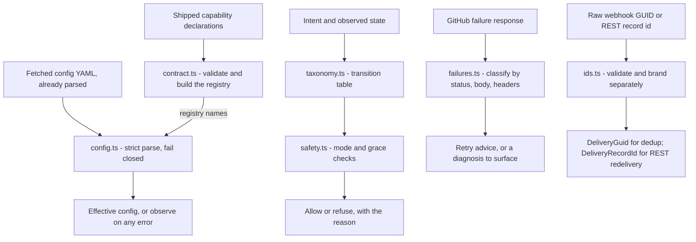

# automation-core (pure logic)

The parallel track from `design/build-plan.md` ("Parallel work the gates do
not block"): the work-item state machine, the safety engine, and the
configuration validator as typed code with invariant tests. No I/O, no
GitHub, no platform — `pnpm test` runs the whole thing in under a second.

| Module | Implements | Source of truth |
|---|---|---|
| `src/taxonomy.ts` | Both workflow state diagrams as transition tables (entity-scoped causes); the blocked-pause and stale-precondition invariants; closure reasons and reopening | `design/core/taxonomy.md` §2–§5, §5.1 |
| `src/observe.ts` | The observed-labels → position projection: a set of mapped meanings in, one position or an explicit conflict out — no repair, no guessing | `design/core/manual-edits.md` §3, §8 tests 2–3 |
| `src/safety.ts` | The action classes, the mechanically checkable write rules, the clock-triggered destructive gates | `design/core/safety.md` §1–§5 |
| `src/config.ts` | Strict configuration validation: unknown keys rejected, defaults off, fail closed; optional capability-registry check | `design/config/schema.md` §2–§4; experiment 6.3 finding |
| `src/contract.ts` | Capability declarations with per-intent idempotency class; registry that feeds `parseConfig` | `design/modules/contract.md` §1 + the D23 amendments (experiments 6.3, 6.5) |
| `src/ids.ts` | Separate branded webhook GUID and REST delivery-record id strings | `FINDING(delivery-id-precision)`, experiment 6.2 |
| `src/failures.ts` | The failure catalogue as classification plus bounded retry advice, tested against observed response bodies | failure table in `design/operations/endpoint-permission-matrix.md` |

The sibling `store/` package holds the owned operational store (protocol
6.5's decision) — it does I/O, so it lives outside this no-I/O track.

## How the pieces connect

Four independent lanes of pure logic. The platform shell (stage five)
supplies every input and performs every side effect; core only decides.

The tests are the executable form of the design's own claims: the
transition matrix is exhaustive (every `(from, to, cause)` triple is either
a documented edge or rejected), destructive actions cannot fire without a
recorded warning and an elapsed grace period, and one config error yields
no configuration at all.

## What the tests prove — and what they do not

The invariant tests prove the *decision logic* is coherent: given true
inputs, the rules compose the way the design says they should. They do not
prove the safety property itself. Two debts are structural and stay with
the stage-five executor:

- **Some inputs arrive by attestation.** `WriteContext` mixes facts the
  core compares itself (`latestHumanChangeAt` against the request's
  `causeObservedAt`) with attestations it must trust
  (`preconditionHolds` — the precondition's shape is capability-specific,
  so the comparison cannot live in capability-agnostic code). A shell that
  supplies a wrong attestation gets a wrong verdict; executor tests own
  that boundary.
- **Verdicts are advisory until the write lands.** The recheck happens
  before the verdict and the GitHub write after it — the usual
  time-of-check/time-of-use window. Closing it is executor work
  (safety.md rules 7–10: postcondition verification and unclear-outcome
  reconciliation), not more pure logic.

Green tests here mean the rules are consistent — not that the system is
safe.

## Findings for the decision register

Coding the prose surfaced ambiguities; each is tagged `FINDING(...)` in the
source at the exact place the assumption was made, and each is recorded in
[`design/decisions.md`](../design/decisions.md) §3 as a hypothesis with this
code as its evidence:

- `FINDING(taxonomy-blocked)` → **D28** — `blocked` is an orthogonal
  pause flag, not a workflow position.
- `FINDING(taxonomy-manual-entry)` → **D29** — manual entry is observed
  reality to reconcile, not a requestable transition.
- `FINDING(safety-grace-floor)` → **D30** — `MIN_GRACE_DAYS = 1`, so the
  floor question cannot be silently skipped.
- `FINDING(config-no-config-mode)` → **D31** — the no-config mode is
  `observe`, chosen over `disabled`.
- `FINDING(safety-human-tie)` → **D33** — the rule-5 comparison lives in
  core; exact-timestamp ties go to the human; the shell excludes the
  causing event.
- `FINDING(config-label-injectivity)` → **D34** — label mappings are
  fully injective: every meaning its own label.
- `FINDING(observe-*)` (three) → **D35** — other-flow meanings are
  ignored-and-reported, `blocked` alone is "no position, paused", closed
  items keep their positions unrepaired.
- `FINDING(config-fail-closed-granularity)` → **D38** — fail-closed is
  whole-file; the config report and PR-time validation are the shell's
  required mitigations.
- `FINDING(safety-killswitch-observations)` → **D39** — the kill switch
  stops observations too; the rest of the check order is reporting-only,
  frozen by the verdict-code tests.
- `FINDING(failures-prose-snapshot)` → **D40** — body regexes are dated
  snapshots; rot degrades into `forbiddenUnrecognized`; a periodic
  sandbox re-probe is the standing operator obligation.
- `FINDING(taxonomy-closure-reason)` → **D47** — closure is a recorded
  reason (`merged` / `closedByHuman` / `completedByLinkedMerge`)
  orthogonal to position, read from GitHub and never written as a label.
- `FINDING(taxonomy-approved-checks-broke)`, `(taxonomy-review-cause)`,
  `(taxonomy-approval-cause)` → **D48** — the missing
  `readyToMerge → needsRevision` edge, the `reviewRequestedChanges`
  cause, and `approvalInvalidated` replacing the trigger-named
  `newCommitsInvalidatedApproval`. All three found by reading the tables
  against `audit/`, not against the prose.
- `FINDING(taxonomy-reopen)` → **D49** — reopening clears the closure
  and moves no position; a merged pull request can never reopen.
- `FINDING(taxonomy-entity-scoped-causes)` → **D50** — issue and
  pull-request causes are separate types, so a cross-flow cause is a
  compile error rather than a runtime refusal.

## Keeping code and prose aligned

The tables and rules here are hand copies of their source documents, so
the working rule is: any edit to a document in the "source of truth"
column above must touch the matching module and its tests.

One of those copies is now checked automatically. `test/doc-drift.test.ts`
parses the state diagrams out of `design/core/taxonomy.md` and asserts
they match `ISSUE_EDGES`/`PR_EDGES` edge for edge, in both directions — a
missing edge and an extra edge are the same defect from either side. It
compares `(from, to)` pairs only, so arrow prose stays human-written and
causes stay covered by the exhaustive matrix; a cause added without a doc
edit still slips through, but a whole edge no longer can. Generating the
diagrams from the tables outright would close the rest and remains the
cheaper long-term option.

Every other table here is still unchecked, and drift is not hypothetical.
The register's D8 row cited five conflict classes that `manual-edits.md`
no longer contains (caught 2026-07-25, row now `replaced`), and D48 is
worse: an edge the audit shows Hiero automation performing today was
missing from the design document *and* the tables, so no comparison
between them could have found it. Consistency checks catch copies that
disagree; only the audit catches a spec that is wrong in both places.

The register rows carry the required next evidence; none of these choices
is ratified by the code alone.
