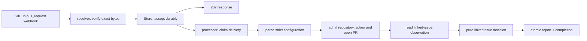

# Architecture

This document describes the Stage 3 system as built. The runnable application has one capability,
`linkedIssue`, and performs no GitHub writes.

## Product boundary

The process receives authenticated GitHub pull-request webhooks for one configured repository,
durably stores each accepted delivery, decides whether a linked-issue advisory is wanted, and stores
a canonical report. It supports `disabled`, `observe`, and `dry-run`; it rejects `active` before
processing because no external effect path exists.

The repository configuration contract is `.github/hiero-automations.yml`:

```yaml
schemaVersion: 1
mode: dry-run

capabilities:
  linkedIssue:
    enabled: true
```

There is no capability registry, generic decision engine, typed-intent layer, label mapping,
principal, permission model, scheduler, or generic safety framework in the current application.

## As-built path



The shortest source-reading path is:

1. `packages/shell/src/receiver.ts`
2. `packages/shell/src/shell.ts`
3. `packages/shell/src/processor.ts`
4. `packages/core/src/config.ts`
5. `packages/core/src/linked-issue.ts`

## Runtime ownership

### Shell

Shell owns I/O and ordering. It verifies the HMAC over the exact bytes received, enforces the body
limit, validates delivery headers, stores the delivery before acknowledgement, claims pending work,
and commits the report through Store.

`REPO_OWNER` and `REPO_NAME` identify the one repository served by the process. Payload owner and
repository names are compared case-insensitively and a mismatch fails closed. Numeric repository and
installation identity binding remains deferred to the real GitHub adapter.

### Core

Core owns three small pure contracts:

- strict parsing of the one YAML shape;
- admission of `pull_request` actions `opened`, `edited`, and `reopened` for an open PR in the
  configured repository;
- a decision over exactly `present`, `absent`, or `unknown` linked-issue observations.

The decision function accepts only non-active modes. `unknown` never becomes `absent`. In observe
mode, absence is recorded without a desired advisory. In dry-run, absence produces exactly one
centralized advisory.

### Store

Store owns durable delivery intake, duplicate/conflicting GUID classification, claim ownership, and
the transaction that inserts one canonical report while completing the delivery. Stage 3 does not
change its source or schema. Existing effect and schedule contracts remain for deliberate Stage 4A
schema contraction.

## Current external-read boundary

The only future GitHub seam is `LinkedIssueReader.read(PullRequestInput)`. It returns `present`,
`absent`, or `unknown`. Tests inject all three. The runnable composition returns `unknown` with an
unavailable reason until Stage 5 supplies authenticated GitHub reads and stronger repository and
installation binding.

## Safety properties

- Trust payload identity only after exact-byte signature verification.
- Reject oversized or malformed requests before durable acceptance.
- Persist accepted work before returning success.
- Treat duplicate delivery identity separately from conflicting GUID reuse.
- Require claim ownership to complete a delivery.
- Store the canonical report and completion atomically.
- Reject invalid configuration and repository mismatches.
- Never propose an advisory from unknown or unavailable linked-issue data.
- Reject active mode; report no applied, posted, or executed GitHub effect.

## Deferred architecture

The following are not current runtime guarantees:

- Store schema contraction is Stage 4A.
- Runtime bounding is Stage 4B.
- GitHub App authentication, installation tokens, real linked-issue reads, and numeric identity
  binding are Stage 5 concerns.
- Managed comments, writes, effect journaling, and recovery come only with a reviewed real effect.
- Retry redesign, poison-delivery handling, graceful shutdown, and multi-worker behavior remain
  deferred.

Future work should extend this ordinary application path only when a real product behavior requires
it. It should not recreate a generic capability or workflow platform.
