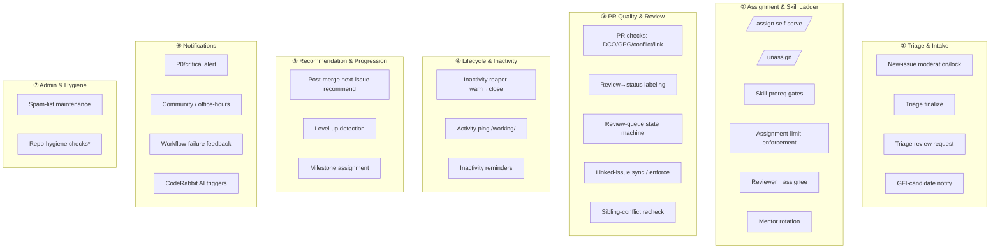
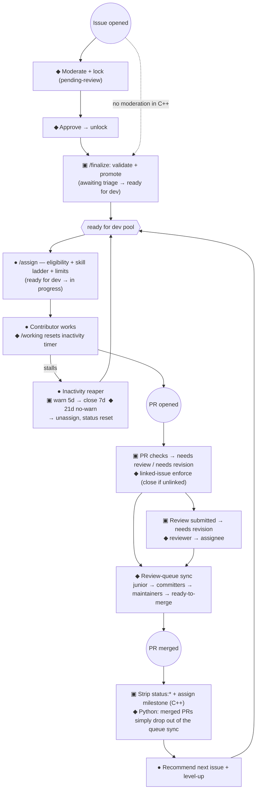

# Cross-SDK Service & Label Architecture

> **Phase 2 synthesis.** A cross-SDK view of the maintainer-automation surface: what each SDK offers,
> how the services group, how an issue/PR flows through them, and a proposed normalized label taxonomy.
> Inputs: `audit/services-cpp.md`, `audit/services-python.md`, `audit/labels-cpp.md`,
> `audit/labels-python.md`. Aligns with `planning/goals.md` (decoupled-by-function, config-driven opt-in).
>
> **Scope:** maintainer-automation only. CI / build / release / security are a project non-goal
> (`goals.md` §Non-goals) and appear only in Appendix Z for completeness.

## 1. High-level service groups

The two SDKs implement the same broad capabilities through very different architectures (C++:
hub-and-spoke off one config; Python: ~40 granular workflows). Abstracted by **function**, the surface
falls into seven groups — the unit of the future per-feature toggle:

\* Repo-hygiene checks (broken-link, test-file-naming) border on CI; de-prioritized per maintainer steer.

## 2. Cross-SDK capability classification

Each row is an **abstract capability** (the toggle candidate), marked by which SDK implements it.
🟢 both · 🔵 C++ only · 🟣 Python only · ⚪ retired.

| Group | Capability | C++ | Python | Status | Notes |
|---|---|:--:|:--:|:--:|---|
| ① Intake | New-issue moderation + lock until approved | — | ✅ | 🟣 | `moderate-new-issues` + `approved-issues` |
| ① Intake | Triage finalize (`/finalize`: validate, retitle, promote) | ✅ | — | 🔵 | central config validation |
| ① Intake | Triage review request (notify triage team on PR) | — | ✅ | 🟣 | `request-triage-review` |
| ① Intake | GFI-candidate notification | — | ✅ | 🟣 | `bot-gfi-candidate-notification` |
| ② Assign | Self-serve `/assign` with eligibility gates | ✅ | ✅ | 🟢 | C++ central limits; Python per-tier handlers + spam-list |
| ② Assign | `/unassign` | ✅ | ✅ | 🟢 | C++ reverts status label; Python assignee-only |
| ② Assign | Skill-ladder prerequisite gating | ✅ | ✅ | 🟢 | C++ `skillPrerequisites`; Python advanced/intermediate guards (unassign on fail) |
| ② Assign | Assignment-limit enforcement | ✅ | ✅ | 🟢 | C++ `maxOpenAssignments`/`maxGfiCompletions`; Python spam-list caps |
| ② Assign | Reviewer → PR assignee | — | ✅ | 🟣 | `on-review` |
| ② Assign | Mentor rotation on assignment | — | ✅ | 🟣 | chained in GFI handler (`mentor_roster.json`) |
| ③ PR | PR quality checks (DCO/GPG/conflict/issue-link) + dashboard | ✅ | partial | 🟢 | C++ unified dashboard; Python only enforces linked-issue (closes) |
| ③ PR | Auto-assign PR author | ✅ | — | 🔵 | in PR Open Checks |
| ③ PR | Review → status labeling | ✅ | — | 🔵 | fork-safe relay → `needs revision` |
| ③ PR | Review-queue state machine (`queue:*`) | — | ✅ | 🟣 | `review-sync` `*/30` cron |
| ③ PR | Linked-issue label sync (issue↔PR) | — | ✅ | 🟣 | fork-safe relay, additive |
| ③ PR | Linked-issue enforcement (close unlinked PRs) | — | ✅ | 🟣 | C++ checks/labels but never closes |
| ③ PR | Sibling-conflict recheck on merge | ✅ | — | 🔵 | re-evaluates other PRs |
| ④ Life | Inactivity reaper (warn → close/unassign) | ✅ | ✅ | 🟢 | **C++ 5d warn→7d act**; Python 21d, no warn |
| ④ Life | Activity ping `/working` (timer reset) | — | ✅ | 🟣 | read by reaper + reminder |
| ④ Life | Inactivity reminders (issue-no-PR, PR-inactive) | — | ✅ | 🟣 | comment-only pre-step to unassign |
| ⑤ Prog | Post-merge next-issue recommendation | ✅ | ✅ | 🟢 | both walk a skill ladder |
| ⑤ Prog | Level-up detection / congratulation | ✅ | ✅ | 🟢 | |
| ⑤ Prog | Milestone assignment on merge | ✅ | — | 🔵 | linked issues / PR |
| ⑥ Notify | P0 / critical issue alert | — | ✅ | 🟣 | `priority: critical` |
| ⑥ Notify | Community / office-hours reminders | — | ✅ | 🟣 | fortnightly crons |
| ⑥ Notify | Workflow-failure feedback on PR | — | ✅ | 🟣 | reacts to 7 named checks |
| ⑥ Notify | CodeRabbit AI plan/review triggers | — | ✅ | 🟣 | complements goals.md "AI complementary" |
| ⑦ Admin | Spam-list maintenance | — | ✅ | 🟣 | hourly cron + tracking issue |
| ⑦ Admin | Slash-command dispatcher (shared parser) | ✅ | — | 🔵 | architectural; Python dispatches per-workflow |
| ⑦ Admin | Repo-hygiene checks (broken-link, test naming) | — | ✅ | 🟣 | borderline CI; de-prioritized |
| — | Merge-conflict bot, auto-draft, draft explainer/reminder, missing/unassigned-linked-issue, verified-commits, conventional-title, standalone GFI-notify/mentor | — | archived | ⚪ | Python `workflows/archive/` (10 files); fold or drop |

**Reading the table.** The 🟢 rows (assignment, `/unassign`, skill gating, limit enforcement, inactivity
reaping, recommendation) are the **common core** — implemented by both, differing only in policy/shape.
These are the strongest Phase-1-app candidates: highest value, proven twice. The 🔵/🟣 rows are
single-SDK and become independent opt-in toggles. ⚪ rows inform what *not* to carry forward.

## 3. The maintainer-automation flow

How a contribution moves through the services, end to end. The journey is shared; each SDK fills
different hops (C++ = `▣`, Python = `◆`, both = `●`).

The label-level state machines that drive these hops are in `audit/labels-cpp.md` (issue + PR `status:`
machines) and `audit/labels-python.md` (moderation + review-queue machines).

## 4. Proposed normalized label taxonomy

The shared app needs one authoritative taxonomy that **absorbs both SDKs and removes the four Python
drift sets** (detailed in `audit/labels-python.md`). Principles: one canonical string per concept;
lower-case `group: value`; one config source of truth (the C++ `hiero-automation.json` model); every
namespace a managed set so prefix operations stay safe.

| Namespace | Canonical values | Absorbs / normalizes |
|---|---|---|
| `status:` (work lifecycle) | `awaiting triage`, `ready for dev`, `in progress`, `blocked`, `needs review`, `needs revision`, `ready to merge` | C++ status set + Python `status: ready-to-merge` (note hyphen→space normalization) |
| `skill:` (ladder) | `good first issue`, `beginner`, `intermediate`, `advanced` | **kills** bare `beginner` (drift C) and title-case `Good First Issue` inconsistency (drift D); `Good First Issue Candidate` → `skill: good first issue candidate` |
| `priority:` | `critical`, `high`, `medium`, `low` | **kills** `Priority: Critical` (drift B) |
| `queue:` (optional review-routing feature) | `junior-committer`, `committers`, `maintainers` | Python-only; stays a feature-scoped namespace, decoupled from `status:` |
| `notes:` (admin/automation bookkeeping) | `automated`, `spam`, `spam-list-update`, `broken markdown links`, `mentor-duty` | pulls Python's inlined `notes:` literals into the config |
| `lifecycle:` (intake gate) | `pending-review`, `approved` | Python moderation; candidate to fold into `status:` (`status: pending review`) |
| `meta:` | `open to community review`, `discussion` | Python markers; static, human/bot-set |

Drift resolution summary (the concrete normalization work the schema must encode):

| Drift | Variants today | Canonical |
|---|---|---|
| A | `Good First Issue Candidate` / `good first issue candidate` | one cased string, matched case-insensitively |
| B | `priority: critical` / `Priority: Critical` | `priority: critical` |
| C | `skill: beginner` / `beginner` | `skill: beginner` |
| D | shared-constant vs inlined `Good First Issue` | single constant, no inline copies |

**Key design carry-over from C++:** with one config file and no hard-coded literals, the C++ SDK has
**zero drift**. Reproducing that single-source-of-truth model in the shared schema is what mechanically
prevents Python's drift from recurring.

## 5. What to support going forward (wishlist → toggles)

Independent, config-gated features, ordered by the "common core first" principle (`goals.md` Goal 3):

1. **Assignment & skill ladder** (🟢) — `/assign`, `/unassign`, prerequisite gates, limit enforcement.
2. **Inactivity reaping** (🟢) — with the **C++ warn→grace→act** policy as the safe default (`goals.md` Goal 5).
3. **Post-merge recommendation + level-up** (🟢).
4. **PR quality checks + review→status labeling** (🟢/🔵) — DCO/GPG/conflict/issue-link → `status:`.
5. **Intake/triage** (🔵/🟣) — `/finalize`, moderation+lock, triage review request (as separate toggles).
6. **Review-queue routing** (🟣) — `queue:*` state machine as an opt-in feature namespace.
7. **Linked-issue sync/enforce** (🟣) — additive sync vs close-on-unlinked as separate toggles.
8. **Notifications** (🟣) — P0 alert, reminders, workflow-failure, CodeRabbit AI hooks; each independent.
9. **Admin** (🟣) — spam-list maintenance, mentor rotation.

Out: repo-hygiene/CI-adjacent checks and the 10 retired Python workflows (do not port).

## Appendix Z — out of scope (non-goal)

CI / build / release / security are native Actions per repo and are **not** absorbed (`goals.md`
§Non-goals). Listed once for completeness; both SDKs' build/test/lint/publish workflows touch **no
labels** (verified — see `audit/labels-cpp.md` Appendix C, `audit/labels-python.md` Appendix D). They are
excluded from all classification, flow, and taxonomy work in this audit.
