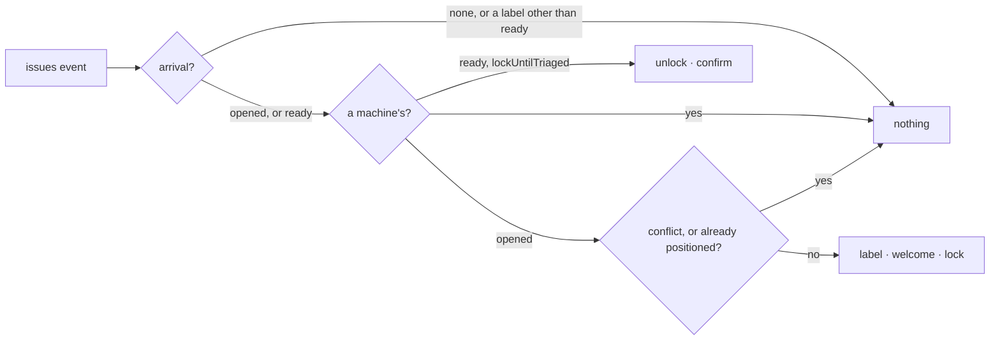

# triageQueue — put a new issue in the triage queue: label it, welcome its author, hold it until triaged

Not built: phase 3.

## What the output looks like

TriageQueue is the front gate every new issue passes through. "The team" in its comments means whoever
the repository gave triage access or above — the people GitHub lets add a label.

On open, when the repository asked for a welcome:

> 👋 Hi @alice — thanks for opening this issue. It is in the triage queue; the team will triage it and
> follow up here.

On open, when the repository locks until triage. This welcome is posted whether or not `welcome`
is on, because a lock with no word about why is the one outcome an author resents:

> 👋 Hi @alice — thanks for opening this issue. It is in the triage queue, and the conversation is
> locked until the team has triaged it. You do not need to do anything: the lock lifts when the
> issue is marked ready, and we will follow up here.

On release, when the repository asked to confirm:

> ✅ Hi @alice — this issue has been triaged and marked ready. The conversation is open again.

## What the config looks like

Label only — the default once triageQueue is enabled:

```yaml
capabilities:
  triageQueue:
    enabled: true
```

Label and welcome:

```yaml
capabilities:
  triageQueue:
    enabled: true
    welcome: true
```

Quarantine — label, welcome, lock; release when a person adds the `ready` label:

```yaml
capabilities:
  triageQueue:
    enabled: true
    lockUntilTriaged: true
    confirmUnlock: true

mappings:
  labels:
    awaitingTriage: "status: pending-review"
    ready: "status: ready for dev"
```

`lockUntilTriaged` needs no release list: the workflow map has one edge out of `awaitingTriage`,
and it goes to `ready`, so the arrival of that meaning is what completes triage. The people who can
add the label are the authorization — GitHub lets triage access and above apply labels — and no
role is ever read, so "triaged" means exactly that: someone with that access marked it ready. `confirmUnlock` is inert without `lockUntilTriaged`.

## How it works

Two stations on a new issue's front gate, both webhook-driven. On `issues.opened`: the
`awaitingTriage` label, the welcome where asked or where locking, then the lock — last, so the
author can read why. On `issues.labeled` carrying `ready`: the unlock where the issue is locked,
then the confirmation where asked.

The release reads the label that arrived, not the position it produced. A `ready` added beside a
stale triage label is a two-position conflict the map reports and never repairs (D35), and it is
still an approval a person made — so the unlock is asked for anyway. A conflicted issue at open is
skipped, as before.

Never acts on: a removed label (nothing re-locks — the human's removal stands), any other label, a
lock a human placed on a repository that never asked to lock, a bot-opened issue, a label a bot
added, or a sweep. A sweep record carries no arrival, so triageQueue asks for nothing on it: a missed
`opened` webhook is not repaired on the next sweep (D206).



| Declaration | Value |
|---|---|
| `triggers` | `issues` |
| `facts` / `needs` | `issue`, no group read |
| `resolvers` | `isAutomationActor` — asked about the author on `opened`, about the sender on `labeled` |
| `intents` | `applyMappedLabel` · `postManagedComment` · `lockIssue` · `unlockIssue` |
| `requiredMappings` | `labels: awaitingTriage` |
| Permissions | repository `issues:read`, `issues:write` |
| Platform needs | none — the issue record carries `locked` and `arrival` (D206) |

| Phase | Ships | Needs first |
|---|---|---|
| 1 | the label and the optional welcome | shipped |
| 2 | lock on open, unlock on `ready`, optional confirmation | shipped — protocol 6.15 confirmed both endpoints; `locked` and `arrival` ride on the issue record |
| 3 | advisory checks for skill tier, issue type and native project fields | issue type and native field values on the observation, a fact-shape change · the `skills` family read · a `types` mapping family for label-based repositories |

## Verified by

| Scenario | Proves |
|---|---|
| Issue opened, `lockUntilTriaged` | label, welcome, then lock — in that order |
| Issue opened, `lockUntilTriaged` and `welcome: false` | the welcome still posts |
| `ready` added by a person to a locked issue | unlock, then the confirmation where asked |
| `ready` added while the triage label is still on | the conflict is not a refusal: the unlock is asked for |
| `ready` arrives before the lock landed | confirmation only; no unlock is asked for |
| `ready` added to a locked issue where `lockUntilTriaged` is off | nothing — the lock is a human's |
| `ready` added by an automation | nothing |
| A label other than `ready`, or a label removed | nothing, and the resolver is not asked |
| Issue opened by a bot | nothing, silently |
| Conflicted issue at open | skipped and reported (D35) |
| Sweep record | nothing — no arrival |
| Redelivered `opened` | one welcome, one lock — the journal and the managed identity |
| `mode: dry-run` | every proposed write reported, none sent |
