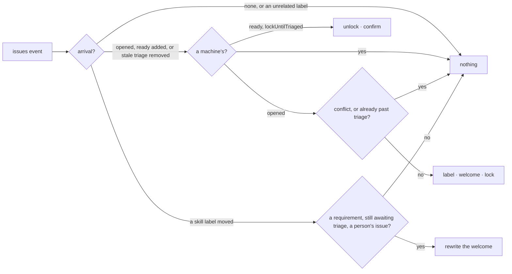

# triageQueue — put a new issue in the triage queue: label it, welcome its author, hold it until triaged

Phase 3 has begun: the welcome carries a checklist, skill first. Nothing moves the issue yet; the
flip to `ready`, the other items, and phase 4 are not built.

## What the output looks like

TriageQueue is the front gate every new issue passes through. "The team" in its comments means whoever
the repository gave triage access or above — the people GitHub lets add a label.

On open, when the repository asked for a welcome:

> 👋 Hi @alice — thanks for opening this issue. It is in the triage queue; the team will triage it and
> follow up here.

On open, when the repository locks until triage. This welcome is posted whether or not `welcome`
is on, because a lock with no word about why is the one outcome an author resents:

> 👋 Hi @alice — thanks for opening this issue. It is in the triage queue, and the conversation is
> locked until the team has triaged it. You do not need to do anything: the lock lifts when the
> issue is marked ready, and we will follow up here.

On open, when the repository asked for a skill requirement. The row is status for the author, who
cannot add labels; the team sets the tier, and the row is rewritten as labels move:

> 👋 Hi @alice — thanks for opening this issue. It is in the triage queue; the team will triage it
> and follow up here.
>
> Triage checklist:
> - [ ] Skill level — the team sets one skill label

On release, when the repository asked to confirm:

> ✅ Hi @alice — this issue has been triaged and marked ready. The conversation is open again.

## What the config looks like

Label only — the default once triageQueue is enabled:

```yaml
capabilities:
  triageQueue:
    enabled: true
```

Label and welcome:

```yaml
capabilities:
  triageQueue:
    enabled: true
    welcome: true
```

Quarantine — label, welcome, lock; release when a person adds the `ready` label:

```yaml
capabilities:
  triageQueue:
    enabled: true
    lockUntilTriaged: true
    confirmUnlock: true

mappings:
  labels:
    awaitingTriage: "status: pending-review"
    ready: "status: ready for dev"
```

Skill requirement — the welcome carries a checklist:

```yaml
capabilities:
  triageQueue:
    enabled: true
    requirements:
      skill: true

mappings:
  skills:
    beginner: "skill: beginner"
    advanced: "skill: advanced"
```

`requirements` is one opt-in flag per thing a triaged issue carries; skill is the first, and each
later item (type, area) is another flag and another row. A flag on with nothing mapped in its
family is refused when the file is read. Any requirement posts the welcome, `welcome` or not,
because the checklist lives in it. The skill row is done when the issue carries exactly one mapped
tier, whichever the file maps — the mapping is the accepted set. No tier, or more than one, leaves
it open, and the row says which. A skill label arriving or leaving while the issue awaits triage
rewrites the same comment, whoever moved the label; the issue must still be a person's. Nothing
moves the issue: when the flip to `ready` is built it reads "every row done" off this same list.
The App never sets a skill label, so it never creates one (D202 covers only labels it sets); the
repository creates the tiers it maps.

Known limit: two label events on one issue inside the same second share an occasion, so the second
rewrite is refused as a repeat and the checklist shows the first event's state until the next label
moves. What identifies an occasion is the platform's question, not this capability's.

`lockUntilTriaged` needs no release list: the workflow map has one edge out of `awaitingTriage`,
and it goes to `ready`, so the arrival of that meaning is what completes triage. The label that
means `ready` is the repository's to spell under `mappings.labels.ready`; unmapped, it is read at
the default `status: ready`. The App creates the labels it sets (D202), so `awaitingTriage` appears
on its own where the repository lacks it — but no capability sets `ready` yet, so nothing creates
it: a maintainer adds it from GitHub's label picker, at the mapped or default spelling. A
repository whose ready label is spelled another way must map it, or the lock never lifts. The people who can
add the label are the authorization — GitHub lets triage access and above apply labels — and no
role is ever read, so "triaged" means exactly that: someone with that access marked it ready. `confirmUnlock` is inert without `lockUntilTriaged`.

## How it works

Two stations on a new issue's front gate, both webhook-driven. On `issues.opened`: the
`awaitingTriage` label where the issue has no position yet, the welcome where asked or where
locking, then the lock — last, so the author can read why. An issue a template already labelled
`awaitingTriage` is still at the gate, so it is welcomed and locked without a second label. On
`issues.labeled` carrying `ready`: the unlock where the issue is locked, then the confirmation
where asked. If `awaitingTriage` is still present, the safety gate refuses that conflicted state;
removing it produces an `issues.unlabeled` delivery and retries the release from the clean `ready`
position.

The release starts when `ready` arrives, or when `awaitingTriage` is removed from an issue already
at `ready`. The platform never repairs a two-position conflict (D35). It waits for the person to
remove the stale triage label, then unlocks from the clean position. A conflicted issue at open is
skipped, as before.

Never acts on: an unrelated removed label (nothing re-locks — the human's removal stands), an
unmapped label, a lock a human placed on a repository that never asked to lock, a bot-opened issue,
an automated workflow-state label, or a sweep. A mapped skill label may come from a person or an
automation: it only rewrites the welcome, and only on a person's issue. A sweep record carries no
arrival, so triageQueue asks for nothing on it: a missed `opened` webhook is not repaired on the
next sweep (D206).

Triaging an issue has more than one outcome: ready for work, blocked on something, more
information needed from the author, or closed as invalid, duplicate or out of scope. This phase
handles the first and knows nothing of the others. Limits until phase 3, for whoever turns
`lockUntilTriaged` on:

- The 8.6 run found that the apply gate compared against the observation time, so the person's own
  label event refused its release (D207). The shell now dates approved effects at evaluation and
  carries that instant into the apply gate (D208). A fresh live run still needs to confirm the fix.
- `ready` is the only release asked for. A triage that ends in `blocked`, in a request for more
  information, or in an area label asks for nothing — and for the author who was asked for more
  information, the lock is exactly what stops them answering.
- An issue opened already carrying the triage label — a template applied it — is welcomed and
  locked without writing the label again. This path also needs confirmation in the fresh live run.
- Closure needs nothing: a closed issue never reaches the capability, and a closed thread that
  stays locked is the ordinary GitHub outcome.
- A locked issue that carries `blocked` cannot be unlocked by the App at all: the platform pauses
  every capability write on a blocked item, the unlock included.
- Turning `lockUntilTriaged` off stops the release too: issues locked before the change need a
  manual unlock. GitHub's issue search finds them: `is:open is:locked` with the triage label's
  spelling.
- Triage done by a workflow token or another App never releases; only a person's label does.



| Declaration | Value |
|---|---|
| `triggers` | `issues` |
| `facts` / `needs` | `issue`, no group read |
| `resolvers` | `isAutomationActor` — asked about the author on `opened` and on a checklist label, about the sender on `ready` |
| `intents` | `applyMappedLabel` · `postManagedComment` · `lockIssue` · `unlockIssue` |
| `requiredMappings` | `labels: awaitingTriage` |
| Permissions | repository `issues:read`, `issues:write` |
| Platform needs | none — the issue record carries `locked` and `arrival` (D206) |

| Phase | Ships | Needs first |
|---|---|---|
| 1 | the label and the optional welcome | shipped |
| 2 | lock on open, unlock on `ready`, optional confirmation | shipped — protocol 6.15 confirmed both endpoints; `locked` and `arrival` ride on the issue record |
| 3a | the checklist in the welcome, rewritten as labels move; `requirements.skill` | shipped — unit-verified only; a live run of a label move is pending |
| 3b | the flip: `ready` on the map's own edge when every row is done, then the unlock and a word on what completed; more rows — type, area — each a flag and a row; `blocked` and needs-more-information outcomes | a `types` mapping family · a `needsInfo` meaning · the unlock exempted from the blocked pause, a safety-rule change with its own row · the occasion identity for same-second label events |
| 4 | native items on the checklist: GitHub's issue type, and project fields such as priority | issue type and field values on the observation, a fact-shape change · the reads they need confirmed in the lab · the org-wide ceiling question the register parks (D57) |

## Verified by

| Scenario | Proves |
|---|---|
| Issue opened, `lockUntilTriaged` | label, welcome, then lock — in that order (8.6: 18:41:20, :24, :25) |
| Issue opened, `lockUntilTriaged` and `welcome: false` | the welcome still posts |
| Issue opened already carrying the triage label (a template applied it) | welcome and lock asked for, no second label; fresh live confirmation pending after D208 |
| `ready` added by a person to a locked issue | unlock, then the confirmation where asked |
| `ready` added while the triage label is still on | the conflict is not repaired; removing the stale triage label retries the release from `ready` |
| `ready` added on a clean position | unlock and optional confirmation; fresh live confirmation pending after D208 |
| `ready` arrives before the lock landed | confirmation only; no unlock is asked for |
| a skill label added or removed while awaiting triage, by anyone | the welcome is rewritten with the row's new state; unit only, no live run yet |
| a skill label on a bot-opened issue, or off the gate, or without the requirement | nothing, and no question asked off the gate |
| `ready` added to a locked issue where `lockUntilTriaged` is off | nothing — the lock is a human's |
| `ready` added by an automation | nothing |
| A label other than `ready`, or an unrelated label removed | nothing, and the resolver is not asked |
| Issue opened by a bot | nothing, silently |
| Conflicted issue at open | skipped and reported (D35) |
| Sweep record | nothing — no arrival |
| Redelivered `opened` | one welcome, one lock — the journal and the managed identity (8.6: `deliveryDuplicate`) |
| `mode: dry-run` | every proposed write reported, none sent |
