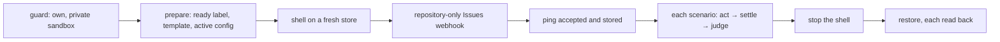

# rehearsal — the triage queue on real GitHub, scripted

Protocol [8.6](../../protocols/8.6-triage-queue-live.md) as one command. It arms `triageQueue` on a
personal sandbox and runs the shell from this checkout with writes armed and no sweep. It then acts
as a person through the operator's own token, and after **every** step it reads back GitHub and the
shell's store. Tests verify the judgements here; only the live run verifies the platform.

It owns the sandbox for the length of a run and nothing else: no App setting, no other installation,
no repository the token's own account does not own, and no public repository.

## A run



A step **settles** when GitHub's delivery log has grown, the receiver answered `202` to every
attempt, the store finished every delivery the log lists, and nothing changes for ten seconds. Its
**judgement** compares the issue's labels, lock, App comments and App label writes with the step's
expectation. It also requires every refusal the step names among that step's decisions, and no
effect left `unknown`. Interrupting with Ctrl-C stops the shell and still restores the sandbox.

| File | Question |
|---|---|
| `run.ts` | What does a run check, change and restore, in what order? |
| `rehearse.ts` | How is one scenario acted out and judged? |
| `scenarios.ts` | What does each scenario do, and what must GitHub read back after every step? |
| `judge.ts` | Has a step settled, and how does what was read differ from what was expected? |
| `sandbox.ts` | What does a run change on the sandbox, and how is each change put back? |
| `shell.ts` | How is the shell under test started, read and stopped? |
| `github.ts` | How does the rehearsal call GitHub as the person? |

## Running it

Start a tunnel to the port first, for example `cloudflared tunnel --url http://localhost:8790`.
Then, from `packages/dev/lab`:

```bash
APP_ID=… INSTALLATION_ID=… PRIVATE_KEY_PATH=… APP_SLUG=… \
SANDBOX_REPO=owner/repo PUBLIC_URL=https://… GITHUB_TOKEN=… \
pnpm lab:rehearse [scenario …]
```

`GITHUB_TOKEN` is the operator's own token, with `repo` scope; the shell never receives it.
`prelabelled-template` waits up to fifteen minutes for a person to submit the printed form.
Evidence goes to the untracked `evidence/triage-rehearsal-<run>/`: the JSONL record of every step,
the shell's log, and a copy of its store.

## Traps

- Delivery GUIDs, payloads and the tunnel URL stay in the evidence archive. A protocol publishes
  only the commit, the GUIDs, the decisions and the conclusions.
- The run records whether `core`, `runtime` or `capabilities` differ from the commit it names.
  Only a clean run on a merged commit is evidence about that commit.
- A repository webhook proves the route to this receiver, not the App's own event subscription.
- On Windows, stopping the shell kills it; the archived store therefore includes its write-ahead
  log.
