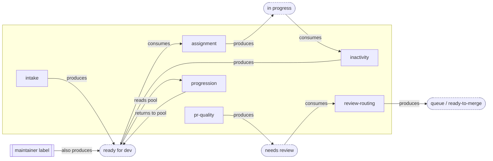

# Opt-In Modules: Decoupling the Capabilities
> DRAFT
> **What this covers:** a working hypothesis of how the maintainer-automation capabilities become independent modules. This doc is complementary to `planning/solution.md` which gives the project architecture.
>
> **What is not covered:** there is no decision on what modules should be supported in a solution; only a theoretical overview on how they could be separated is illustrated. There is no consensus yet on the label taxonomy, just placeholders.
>

## 1. The problem, stated

The audit found the capabilities chained through one shared label spine. `/assign` cannot run unless
something produced `status: ready for dev`; `/finalize` is the only thing that produces it from triage;
inactivity and recommendation both read the state assignment leaves behind. So "enable just assignment"
isn't a config choice today — disable `/finalize` and `/assign` starves; disable `/assign` and items pile
up at `ready for dev` with no consumer. (`audit/coupling-cpp.md` §5.1)

If modules depended on **each other**, you could never take one without its neighbours. The whole point of
opt-in modules is to break that.

## 2. The decoupling rule

**A module never depends on another module — only on the core.** What it shares it shares *through* the
core (state it can read or request, read-only resolvers, declared cross-entity reads), never by naming,
calling, or importing a sibling. Three parts make this hold:

1. **The core owns every state and every shared computation.** The work-item state machine (`solution.md`
   §4) defines the states and legal transitions, and the canonical resolvers (`solution.md` §4: skill
   level, linked issue, is-bot) define the shared read-only logic — both independently of which modules
   are installed. The spine and the resolvers exist even if only one module is on.
2. **A module declares its full contract** — the states it consumes/produces, the resolvers it reads, and
   any cross-entity reads it needs. It never names, calls, or imports another module. It reaches the core;
   the core reaches GitHub.
3. **Every state has a non-module way in.** Any state a module consumes can also be reached by a
   maintainer applying the label by hand, by a config default, or by a slash command — so no module
   *requires* the module that would normally produce that state. Upstream modules **automate** an entry
   point; they are never the **only** entry point.

The consequence: enabling any single module gives you a functional-but-manual version of that capability.
Adding the upstream module automates its inputs; removing it drops you back to manual. Nothing breaks,
nothing starves — it just gets more or less hands-off. That is "dial a feature up or down" from
`goals.md`.

## 3. The module catalogue

Each module is one independently togglable unit (`lessons-learned.md` D1: never bundled behind a shared
trigger). The state names are the audited placeholders.

| Module | What it does | Consumes (state in) | Produces (state out) | Standalone when its upstream is off |
|---|---|---|---|---|
| **intake** | moderate/lock new issues, `/finalize` validate + promote | issue opened | `awaiting triage` → `ready for dev` | n/a — it is the producer; maintainers can also set `ready for dev` by hand |
| **assignment** | `/assign`, `/unassign`, skill gates, limits | `ready for dev` | `in progress` ↔ `ready for dev` | works whenever `ready for dev` is set — by intake **or** by a maintainer label |
| **inactivity** | warn → close/unassign stalled work, `/working` reset | `in progress` (assigned) | `ready for dev` (or closed) | acts on any assigned in-progress item, regardless of who assigned it |
| **pr-quality** | DCO/GPG/conflict/link checks + dashboard | PR opened | `needs review` / `needs revision` | fully self-contained on the PR side |
| **review-routing** | review → status, queue state machine | `needs review` | `queue:*` / `ready-to-merge` | works whenever `needs review` is set — by pr-quality **or** by hand |
| **progression** | post-merge recommend, level-up, milestone | PR merged + the `ready for dev` pool | recommendations; strips `status:*` | reads whatever `ready for dev` issues exist; recommends nothing if the pool is empty |
| **notifications** | alerts, reminders, CI-failure feedback, AI hooks | events only | comments only — **no state** | fully standalone; touches no shared label (`lessons-learned.md` A-class risks don't apply) |
| **admin** | spam-list, mentor rotation | assignment events | `notes:*` bookkeeping | standalone; degrades to no-op without the events it watches |

The pattern in the table: every "standalone when upstream is off" cell resolves to *"the state it needs
can also be set manually"* — that column is the decoupling rule made concrete.

## 4. Interaction architecture: how modules talk through the core

Modules never call each other. They interact only **through the core**, on three channels. (Why these are
the channels, the source-verified inventory of what is coupled in C++ today, and the essential-vs-accidental
rule for deciding what to remove, all live in `lessons-learned.md` — this section is the target design, not
the diagnosis.)

### 4.1 Channel 1 — shared state

The dependency graph has **no module-to-module edges.** Every arrow goes module → state → module, and the
core owns the states in the middle.

Read it as: assignment and intake never reference each other — they both reference `ready for dev`, and so
does the manual entry point. Cut intake out and the `ready for dev` node still has an inbound edge
(`maintainer label`), so assignment keeps working. That missing module-to-module edge **is** the
decoupling.

### 4.2 Channel 2 — shared core resolvers

Where two modules must *agree* on a computation, they call **one resolver in the core** rather than each
carrying a copy. The core exposes the canonical resolvers (`solution.md` §4): `eligibleLevel(user)` over
the one skill ladder, `linkedIssues(pr)` by one mechanism, `isBot(actor)`. **assignment** and
**progression** both gate and recommend off `eligibleLevel` — they agree by construction and neither
imports the other. This is how the skill-ladder coupling (`lessons-learned.md` appendix, rows 5–6) is kept
*essential and single-sourced* instead of duplicated.

### 4.3 Channel 3 — declared cross-entity reads

When a module must read or write across the PR↔issue link, it **declares that in its contract** (§5) and
goes through a core resolver — it never reaches into another entity's handler. So pr-quality asks the core
"is the author assigned to the linked issue?" rather than scraping issue state itself, and issue-side
propagation on merge or reap is its own opt-in step, not baked into a PR handler (`lessons-learned.md` C1,
appendix rows 7–10).

That is the whole interaction surface: shared state via the core's state machine, shared meaning via the
core's resolvers, cross-entity access via declared contracts. No fourth channel, and no module-to-module
edge anywhere.

## 5. Worked example: dialling assignment up and down

The capability you flagged — assignment, today tied to progression and intake — across three install
levels:

- **assignment only.** A maintainer labels an issue `ready for dev`; a contributor runs `/assign`; the
  core moves it to `in progress` and records the assignee. `/unassign` returns it. Fully functional —
  maintainers just produce and reclaim `ready for dev` by hand.
- **+ intake.** `/finalize` now produces `ready for dev` from triage automatically. Assignment is
  unchanged — it still just consumes the state; it neither knows nor cares that intake now fills the pool.
- **+ inactivity + progression.** Stalled items return to the pool automatically; merges recommend the
  next issue. Again assignment's own code is untouched — the extra automation plugs into the same states
  around it.

At no level does enabling or disabling a neighbour require editing assignment. That is the test from
`goals.md`: "turning a feature off is one config edit and has no side effects on the others."

