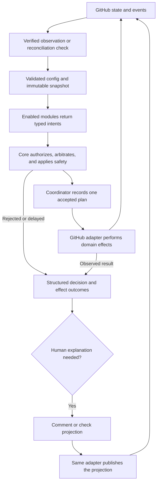

# Solution Overview

This is a visual summary of the proposal in [`solution.md`](solution.md).

The boundaries are intentional:

- GitHub remains the visible source of issue, pull request, assignment, review, and label state.
- Modules receive immutable domain facts and their validated config slice. They return requests, not GitHub calls.
- The core owns authorization, transitions, conflict resolution, and destructive-action safety.
- Coordination refreshes the decision and records one winner before external writes begin.
- Only the adapter calls GitHub, and it changes only state the app owns.
- Outcomes are structured machine records. Optional comments and checks explain them to humans but never drive
  automation.
- Reconciliation detects missed events and partial plans and converges them with current GitHub state.

The existing taxonomy, config, and testing drafts provide starting points. Exact module contracts, security and
quality gates, evidence notes, and implementation sequencing should follow architecture ratification.
