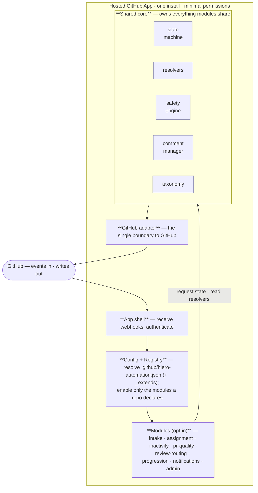

# Solution Overview — Architecture at a Glance (work in progress)

> ⚠️ **Work in progress.** This is the high-level map of the layers, meant as the entry point to the design,
> not the specification. It will change as the open decisions below are settled. The detailed design lives
> in the linked docs.
>
> **The doc set this sits on top of:**
> - `planning/opt-in-modules.md` — the modules and how they interact through the core
> - `planning/test-architecture.md` — how the layered system is tested
> - `planning/lessons-learned.md` — the coupling failures this design is built to avoid
> - `planning/goals.md` — the vision and constraints

## The shape in one picture

A hosted GitHub App in layers: events come in at the top, flow down through config and the opt-in modules,
and **only the core touches GitHub on the way back out.**

## The layers, one line each

| Layer | Responsibility | Detail in |
|---|---|---|
| **App shell** | Receive GitHub webhooks; one install; minimal scopes (`issues:write` · `pull-requests:write` · `contents:read`) | solution.md §2 |
| **Config + Registry** | Load and validate the repo's config, resolve `_extends` org defaults, enable only the declared modules with only their declared permissions | solution.md §3, §6 |
| **Modules (opt-in)** | Independent capabilities a repo switches on one at a time; each declares a contract and talks **only to the core** | opt-in-modules.md |
| **Shared core** | Owns every piece of state and logic modules share — the `status:` state machine, the canonical resolvers, the safety/grace-period engine, the comment manager, the taxonomy | solution.md §4 |
| **GitHub adapter** | The single place that calls GitHub, so the external contract is modelled (and tested) once | test-architecture.md §2.3 |

